```{r setup, include=FALSE, cache=FALSE, results='hide'}
library(knitr)
library(stringr)
library(gplots)
library(xtable)

opts_chunk$set(echo = FALSE, cache = FALSE, cache.path = '../cache/', fig.path = 'assets/NCKU/')
```

## Outline
1. Why study mental simulation
2. How to measure mental simulation
3. Experiment and findings
4. Reproducibility
</br>
</br>
[Check source files](https://github.com/SCgeeker/ActObj)

--- .dark .segue

## Why study mental simulation?

--- &twocol
## Language Comprehension: Two Perspectives
**Colorless green ideas sleep furiously.**

*** =left
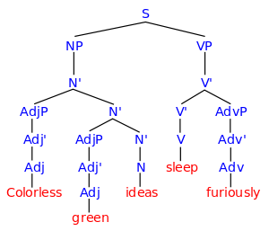

*** =right
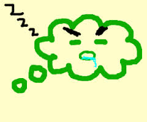

*** =pnotes
Standard Cognitive Computation vs. Conceptualized Embodiment</br>

--- &twocol
## Embodied Cognition: How many perspectives?
 |Shapiro(2010) |Rowlands(2010)  
--- | ------------- | --------------  
 |<font color="red">Conceptulization</font>|Embodied mind  
 |Replacement |Enacted mind  
 |Constitution |Extended mind, Embeded mind  

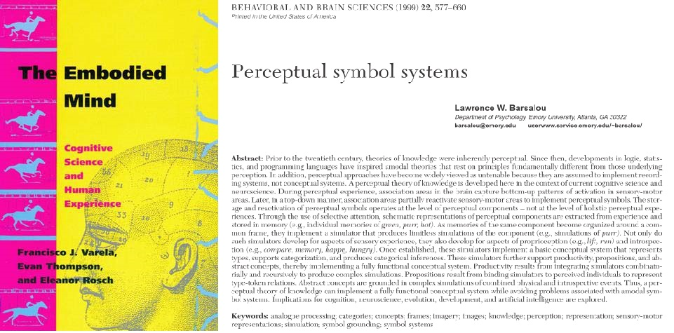


--- .dark .segue

## How to measure mental simulation?

--- 
## Measurements
>- Sentence-picture verification task
  + Matching effect
>- Word color discrimination
  + Compatibility effect (Simon effect)

---
## Sentence-picture verification: Example
>- I want to eat the **egg** in the *dish*.

>- Match the **picture** and **bold word** in next slide.

---
## Sentence-picture verification: Example

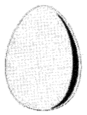   

>- <center>Hardly choose **YES**?</center>  

Is it match?  

1. YES
2. NO


---
## Matching Effects

```{r echo=FALSE, comment=NA, results='asis', label="ZSYTable"}
ZSY2002.table <- xtable(matrix(c(697, 761, 97, 93), 2, 2, byrow=T, dimnames = list(c("RT", "Correct Rate"), c('Match', 'Mismatch'))) )
align(ZSY2002.table) <- "|c|c|c|"
print(ZSY2002.table, type = "html",floating=FALSE)
```
  
Zwaan, Stanfield, & Yaxley (2002)   
>- Supoort **Perceptual Symbol System**(Barsalou, 1999)  
>- Embodied Simulation Hypothesis: "Perceptual symbols are activated after reading sentence"   

---
## Matching Effects
>- Positive matching effect (Match < Mismatch)
   + shape (Zwaan, Stanfield, and Yaxley, 2002)
   + orientation (Stanfield & Zwaan, 2001)
>- Negative matching effect (Match > Mismatch)
   + color (Connell, 2007)
>- Replication problem
   + Zwaan & Pecher(2012)
   + color > shape > orientation
>- Thinking
   + Sentence-picture verification is a potential tool to inspect language comprehension rather than to inspect embodied cognition
   + ["... I see embodiment as a means and not as an end."](http://rolfzwaan.blogspot.tw/2013/01/reproducing-pencils-and-eagles-but-not.html) (retrieved from Rolf Zwaan's blog, 2013/1/15)


--- &vcenter .large
</br>
</br>
<center><h3>Could we investigate the implicit processing of mental simulation?</h3></center>
</br>
>- <center>There is no standard paradigm to measure the implicit mental simulation.</center>

---
## Extrinsic Affective Simon Task (EAST; De Houwer, 2003)
>- Word meaning classification -> Establish meaning-response compatibility
   + Key 1 = *Happy*   Key 2 = *Disgust*
>- Word color discrimination -> Measure compatibity effect
   + Key 1 = <font color="blue">Color1</font>    Key 2 = <font color="green">Color2</font>
   + Word 1 = *Happy*  Word 2 = *Disgust*
>- Compatible Case
   + Key 1 ~ <font color="blue">*Happy*</font>   Key 2 ~ <font color="green">*Disgust*</font>
>- Incompatible Case
   + Key 1 ~ <font color="blue">*Disgust*</font>   Key 2 ~ <font color="green">*Happy*</font>

---
## Original EAST Results
```{r HouwerTable, echo=FALSE, comment=NA, results='asis'}
Houwer.table <- xtable(matrix(c(660, 636, 707, 678), 2, 2, byrow=T, dimnames = list(c("Compatible Response", "Incompatible Response"), c('Word meaning: Happy', 'Word meaning: Disgust'))) )
align(Houwer.table) <- "|l|r|r|"
print(Houwer.table, type = "html",floating=FALSE)
```
De Houwer(2003), Experiment 1

---
## Modified EAST Design
>- Word meaning classification 
   + ＞＞＞ Sentence-picture Verification
   + Build **situation** in imagination
>- Word color discrimination 
   + Critical words associated _actions_ and _feelings_
   + Actions and feelings matched the **situation**
>- Two measurements
   + Matching effect: Sentence-picture Verification
   + Compatibility effect: Word color discrimination

---
## Hypothesis
- Embodied Simulation Hypothesis 
  - People comprehend the linguistic forms of objects as the way people **see** the objects in the real world (Bergen, 2012).
  - **see** -> **move**? **observe**?

>- I will **take** this iron box.
>- I will **touch** this iron box.

---
## Situational Properties 
>- **Actions**
   + Observe: have not to exhaust strength
   + Move: have to exhaust strength
>- **Objects**
   + Observed objects generate the feeling about *texture*
   + Moved objects generate the feeling about *weight*
>- **Feelings**
   + Texture
   + Weight

---
## Critical Measurements
>- Matching effect 
   + Which constituents in the situation could be explicit to our imagination?
>- Compatibility effect
   + Which constituents in the situation have the advantage established the implicit association of two unrelated imagination?

---
## Predictions
>- Sentence-picture verification task: human mind would simulate the **action** on the target **object** and the **feeling**.
  + Matching effect would happen to the pitcure that does not match the probe sentence.
>- Word color discrimination task: human mind would process the implicit association of the **action** and the **feeling**.
  + Compatibility effect would happen to the word represented **action** or **feeling** but the color instructed the incompatible response key.

--- .dark .segue

## Experiment and findings

---
## Procedure
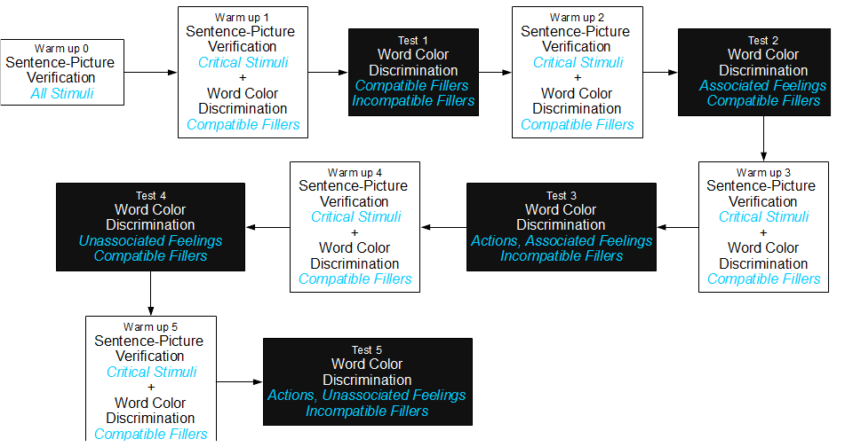

---
## Sentence-Picture Verification: Stimuli Sentence
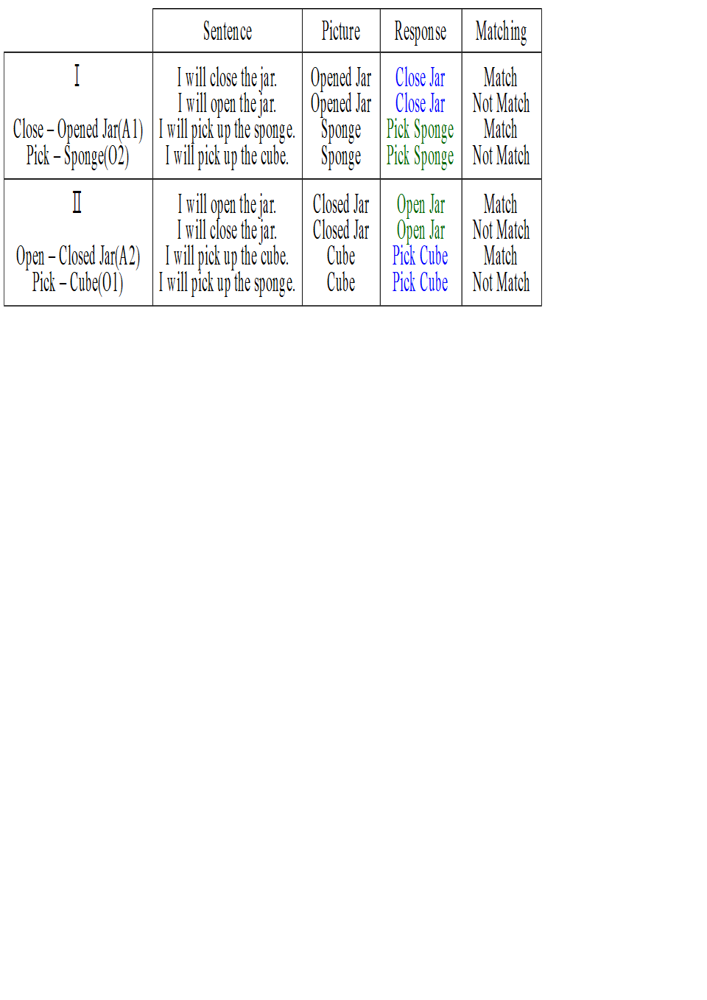

---
## Sentence-Picture Verification: Stimuli Picture


---
## Sentence-Picture Verification: Response keys
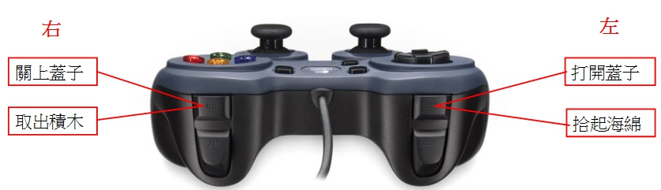

---
## Word Color Discrimination: Twist-Tight Pick-Soft
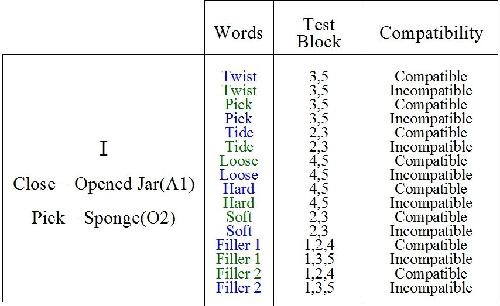

---
## Word Color Discrimination: Twist-Loose Pick-Hard
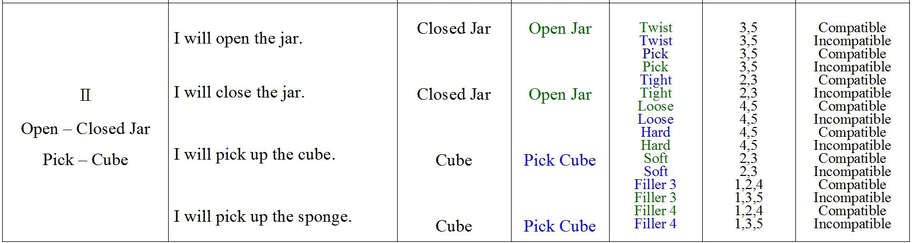

---
## Word Color Discrimination: Response keys
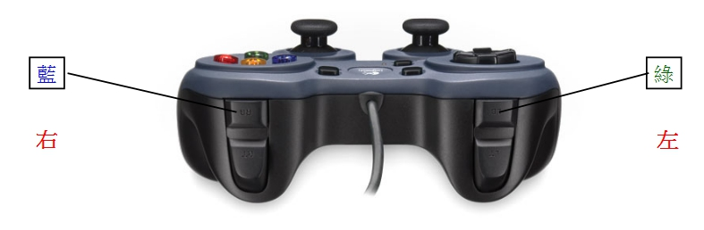

---
## Analysis protocal
>- Sentence-picture verification
   + Response key sets _X_ Matching
   + All trials in **warm up blocks**
>- Word-color discrimination
   + Three sets of target words: Blue critical, Green critical, Filler
   + Critical words: Word types _X_ Association types _X_ Compatibility
   + Filler words: Word types _X_ Test Blocks _X_ Compatibility
```{r SP-Dataset, echo = FALSE, warning=FALSE, message=FALSE}
#library(multcomp)

# Tidy data of sentence-picture verification
AB_DATA <- read.csv("../AB.csv")
attach(AB_DATA)
AB_RT <- tapply(RT, paste0(F1, F2, F3), mean)
AB_RTsd <- apply(
matrix(
  matrix(RT,2)[2,] - matrix(RT,2)[1,], nlevels(F2)
), 1, sd
)
AB_PE <- tapply(PE, paste0(F1, F2, F3), mean)
nA <- sum(F1 == 'A')/4
nB <- sum(F1 == 'B')/4
detach(AB_DATA)
## Arrange  Sentence-Picture Verification DATA
## F1 = Series (A, B)
## F2a = Actions (W = Twist; P = Pick)
## F3 = Compatibility (C = Compatible, I = Incompatible)

F2a <- c(
    rep(c('W', 'W', 'P', 'P'), nA),
    rep(c('P', 'P', 'W', 'W'), nB)
)
SP_RT_M <- matrix(
  AB_RT,2,4,
  dimnames = list(c("C", "I"), c("Close Jar", "Pick Sponge", "Pick Cube", "Open Jar"))
)
#round(SP_RT_M,  digits = 2  )

SP_RTse_M <- matrix(
     rep(AB_RTsd, each=2)*t(c(1/rep(sqrt(nA),4), 1/rep(sqrt(nB),4)))
    ,2,4,
    dimnames = list(c("C", "I"), c("Close Jar", "Pick Sponge", "Pick Cube", "Open Jar"))
)
```

```{r WordColor-Dataset, echo=FALSE, results='hide', message=FALSE}
# Tidy data of color discrimination
T_DATA <- read.csv('../TEST.csv')

FILL = subset(T_DATA,(F4 == 'B' | F4=='W'))
CRITIC = subset(T_DATA,(F4 == 'V' | F4=='A' | F4=='O'))
# Response sets of filler words
attach(FILL)
FILL_RT <- tapply(RT, paste0(F1, F4, F2, F3), mean)
FILL_RTsd <- tapply(RT, paste0(F1, F4, F2, F3), sd)
FILL_RTsd <- apply(
    rbind(
    matrix(
        matrix(RT,2)[2,] - matrix(RT,2)[1,], 4
     )[,1:20],
    matrix(
        matrix(RT,2)[2,] - matrix(RT,2)[1,], 4
    )[,21:40]
    )
    , 1, sd, na.rm = T
)
FILL_PE <- tapply(PE, paste0(F1, F4, F2, F3), mean)
detach(FILL)

# Response sets of critical words
attach(CRITIC)
CRITIC_RT <- tapply(RT, paste0(F1, F4, F2, F3), mean)
CRITIC_RTsd <- tapply(RT, paste0(F1, F4, F2, F3), sd)
CRITIC_RTsd <- apply(
    rbind(
        matrix(
            matrix(RT,2)[2,] - matrix(RT,2)[1,], 6
        )[,1:20],
        matrix(
            matrix(RT,2)[2,] - matrix(RT,2)[1,], 6
        )[,21:40]
    )
    , 1, sd
)
CRITIC_PE <- tapply(PE, paste0(F1, F4, F2, F3), mean)
detach(CRITIC)
## F1 = Series_Code (I: Series A; J: Series B)
## F2 = Target_Code (W = Critical Verb 1; P = Critical Verb 2; S = Critical Sense 1; L = Critical Sense 2)
## F3 = Effect_Code (C = Congruent; I = Incongurent)
## F4 = Type of Critcial Word (V = Verb; A = Senses of Twist; O = Senses of Pick)
## Positions in CRITIC_RT: 11, 12, 21, 22, 3, 4, 7, 8, 19, 20, 15, 16
BLUE_CRIT = subset(T_DATA,
                   (F1 == 'I' & F4 == 'V' & F2 == 'W') |
                       (F1 == 'J' & F4 == 'V' & F2 == 'P') |
                       (F1 == 'I' & F4 == 'A' & F2 == 'S') |
                       (F1 == 'I' & F4 == 'O' & F2 == 'S') |
                       (F1 == 'J' & F4 == 'O' & F2 == 'S') |
                       (F1 == 'J' & F4 == 'A' & F2 == 'S') 
)

GREEN_CRIT = subset(T_DATA,
                    (F1 == 'I' & F4 == 'V' & F2 == 'P') |
                        (F1 == 'J' & F4 == 'V' & F2 == 'W') |
                        (F1 == 'I' & F4 == 'O' & F2 == 'L') |
                        (F1 == 'I' & F4 == 'A' & F2 == 'L') |
                        (F1 == 'J' & F4 == 'A' & F2 == 'L') |
                        (F1 == 'J' & F4 == 'O' & F2 == 'L') 
)

## Arrange data sets of filler words
## Lables in Design_E.xls:
## F1 = Series_Code (I: Series A; J: Series B)
## F2 = Target_Code (B = Attached to BLUE 1; G = Attached to GREEN)
## F3 = Effect_Code (C = Congruent; I = Incongurent)
## F4 = Sources of Responses (W = Within Block; B = Between Blocks)

BLUE_FILL = subset(T_DATA, F2 == 'B')

GREEN_FILL = subset(T_DATA, F2 == 'G')
```

--- &twocol
## Sentence-Picture Verification: Summary

*** =left
```{r SP-Result1, echo = FALSE, warning=FALSE, error = FALSE, message=FALSE, results='hide'}
SP_RT1 <- barplot2(
   SP_RT_M[,c(1,4)], beside=T,xpd=F,
    ylim = c(350,550),ylab="Response Time(ms)",
    col = c(rep(c("black","white"),2)),         
    plot.ci = TRUE, 
    ci.l = (SP_RT_M[,c(1,4)] - SP_RTse_M[,c(1,4)]), 
    ci.u = (SP_RT_M[,c(1,4)] + SP_RTse_M[,c(1,4)]),
    panel.first = TRUE
)

y.cord<-rbind(c((SP_RT_M[,c(1,4)] + SP_RTse_M[,c(1,4)])[1,]+2),
              c(apply((SP_RT_M[,c(1,4)] + SP_RTse_M[,c(1,4)]),2,max)+5),
              c(apply((SP_RT_M[,c(1,4)] + SP_RTse_M[,c(1,4)]),2,max)+5),
              c((SP_RT_M[,c(1,4)] + SP_RTse_M[,c(1,4)])[2,]+2)
              )

x.cord<-apply(SP_RT1,2,function(x) rep(x,each=2))

sapply(1:dim(SP_RT1)[2],function(x) lines(x.cord[,x],y.cord[,x]))

x.text<-colMeans(SP_RT1)
y.text<-apply((SP_RT_M[,c(1,4)] + SP_RTse_M[,c(1,4)]),2,max)+10
text(c("*","*"),x=x.text,y=y.text)
```

*** =right

```{r SP-Result2, echo = FALSE, warning=FALSE, error = FALSE, message=FALSE, results='hide'}

SP_RT2 <- barplot2(
  SP_RT_M[,c(3,2)], beside=T,xpd=F,
  legend = c("Match","Not Match"),
  ylim = c(350,550),ylab="Response Time(ms)",
  col = c(rep(c("black","white"),2)),         
  plot.ci = TRUE, 
  ci.l = (SP_RT_M[,c(3,2)] - SP_RTse_M[,c(3,2)]), 
  ci.u = (SP_RT_M[,c(3,2)] + SP_RTse_M[,c(3,2)]),
  panel.first = TRUE
)

y.cord<-rbind(c((SP_RT_M[,c(3,2)] + SP_RTse_M[,c(3,2)])[1,]+2),
              c(apply((SP_RT_M[,c(3,2)] + SP_RTse_M[,c(3,2)]),2,max)+5),
              c(apply((SP_RT_M[,c(3,2)] + SP_RTse_M[,c(3,2)]),2,max)+5),
              c((SP_RT_M[,c(3,2)] + SP_RTse_M[,c(3,2)])[2,]+2)
)

x.cord<-apply(SP_RT2,2,function(x) rep(x,each=2))

sapply(1:dim(SP_RT2)[2],function(x) lines(x.cord[,x],y.cord[,x]))

x.text<-colMeans(SP_RT2)
y.text<-apply((SP_RT_M[,c(3,2)] + SP_RTse_M[,c(3,2)]),2,max)+10
text(c("n.s.","*"),x=x.text,y=y.text)
```


---
## Sentence-Picture Verification: ANOVA
```{r echo=FALSE, message=FALSE, warning=FALSE, results='asis', label = "SP-Anova"}
colnames(AB_DATA) <- c("ID","Series","Situation","Matching","RT","PE")
SP.aov <- aov(RT ~Series*Situation*Matching + Error( ID/Matching ), data = AB_DATA )
print(xtable(summary( SP.aov ) ), type="html",floating=FALSE)
```

--- &twocol

## Word Color Discrimination: Critical Blue Words

***=left
```{r Blue-Critical1, echo=FALSE, warning=FALSE, error=FALSE, message=FALSE, results='hide'}
CRITIC_RT_BA <- matrix(
            CRITIC_RT[c(11,12,3,4,7,8)], 2, 3,
            dimnames = list(c("C", "I"), c("Twist","Tight", "Hard"))
)

CRITIC_RTse_BA <- matrix(
    rep(CRITIC_RTsd[c(6,2,4)],each=2)*t(1/rep(sqrt(nA),6)  ), 2, 3,
  dimnames = list(c("C", "I"), c("Twist","Tight", "Hard"))
)

Critical_A_Twist <- barplot2(
  CRITIC_RT_BA, beside=T,xpd=F,
  ylim = c(350,500),ylab="Response Time(ms)",
  col = rep(c("blue","green"), 3),         
  plot.ci = TRUE,
  ci.l = (CRITIC_RT_BA - CRITIC_RTse_BA), 
  ci.u = (CRITIC_RT_BA + CRITIC_RTse_BA),
  panel.first = TRUE
)


y.cord<-rbind(c((CRITIC_RT_BA + CRITIC_RTse_BA)[1,]+2),
              c(apply((CRITIC_RT_BA + CRITIC_RTse_BA),2,max)+5),
              c(apply((CRITIC_RT_BA + CRITIC_RTse_BA),2,max)+5),
              c((CRITIC_RT_BA + CRITIC_RTse_BA)[2,]+2)
)

x.cord<-apply(Critical_A_Twist,2,function(x) rep(x,each=2))

sapply(1:dim(Critical_A_Twist)[2],function(x) lines(x.cord[,x],y.cord[,x]))

x.text<-colMeans(Critical_A_Twist)
y.text<-apply((CRITIC_RT_BA + CRITIC_RTse_BA),2,max)+10
text(c("*","*","*"),x=x.text,y=y.text)

```

*** =right

```{r Blue-Critical2, echo=FALSE, warning=FALSE, error=FALSE, message=FALSE, results='hide'}

CRITIC_RT_BB <- matrix(
    CRITIC_RT[c(21,22,19,20,15,16)], 2, 3,
    dimnames = list(c("C", "I"), c("Pick","Hard", "Tight"))
)

CRITIC_RTse_BB <- matrix(
    rep(CRITIC_RTsd[c(11,10,8)],each=2)*t(1/rep(sqrt(nB),6)  ), 2, 3,
    dimnames = list(c("C", "I"), c("Pick","Hard", "Tight"))
)


Critical_B_Pick <- barplot2(
    CRITIC_RT_BB, beside=T,xpd=F,
    legend = c("Compatible","Incompatible"),
    ylim = c(350,500),ylab="Response Time(ms)",
    col = c( "blue", "green"),         
    plot.ci = TRUE, 
    ci.l = (CRITIC_RT_BB - CRITIC_RTse_BB), 
    ci.u = (CRITIC_RT_BB + CRITIC_RTse_BB),
    panel.first = TRUE
)
y.cord<-rbind(c((CRITIC_RT_BB + CRITIC_RTse_BB)[1,]+2),
              c(apply((CRITIC_RT_BB + CRITIC_RTse_BB),2,max)+5),
              c(apply((CRITIC_RT_BB + CRITIC_RTse_BB),2,max)+5),
              c((CRITIC_RT_BB + CRITIC_RTse_BB)[2,]+2)
)

x.cord<-apply(Critical_B_Pick,2,function(x) rep(x,each=2))

sapply(1:dim(Critical_B_Pick)[2],function(x) lines(x.cord[,x],y.cord[,x]))


x.text<-colMeans(Critical_B_Pick)
y.text<-apply((CRITIC_RT_BB + CRITIC_RTse_BB),2,max)+10
text(c("n.s.","n.s.","*"),x=x.text,y=y.text)

```

---

## Word Color Discrimination: Critical Blue Words

```{r Blue-ANOVA1, echo=FALSE, message=FALSE, warning=FALSE, results='asis'}
colnames(BLUE_CRIT) <- c("ID","Series","Blocks","Situations","Compatibility","RT","PE")
BC_RT.aov <- aov(RT ~ Series*Blocks*Compatibility + Error( ID/(Blocks*Compatibility) ), data = BLUE_CRIT )
print(xtable(summary( BC_RT.aov ) ), type="html",floating=FALSE)

```

---

## Word Color Discrimination: Critical Blue Words

*Twist-Tight*
```{r Blue-ANOVA2, echo=FALSE, message=FALSE, warning=FALSE, results='asis'}
BC_RT_A.aov <- aov(RT ~ Blocks*Compatibility + Error( ID/(Blocks*Compatibility) ), data = BLUE_CRIT[BLUE_CRIT$Series == 'I',] )
print(xtable(summary( BC_RT_A.aov ) ), type="html", digits=0)
```

*** =pnotes
*Pick-Hard*
```{r Blue-ANOVA3, echo=FALSE, message=FALSE, warning=FALSE, results='asis'}
BC_RT_B.aov <- aov(RT ~ Blocks*Compatibility + Error( ID/(Blocks*Compatibility) ), data = BLUE_CRIT[BLUE_CRIT$Series == 'J',] )
print(xtable(summary( BC_RT_B.aov ) ), type="html", digits=0)
```

--- &twocol

## Word Color Discrimination: Critical Green Words

*** =left
```{r Green-Critical1, echo=FALSE, warning=FALSE, error=FALSE, message=FALSE, results='hide'}
CRITIC_RT_GA <- matrix(
  CRITIC_RT[c(9,10,5,6,1,2)], 2, 3,
  dimnames = list(c("C", "I"), c("Pick","Soft","Loose"))
)

CRITIC_RTse_GA <- matrix(
    rep(CRITIC_RTsd[c(5,3,1)],each=2)*t(1/rep(sqrt(nA),6)  ), 2, 3,
  dimnames = list(c("C", "I"), c("Pick","Soft","Loose"))
)

Critical_A_Pick <- barplot2(
    CRITIC_RT_GA, beside=T,xpd=F,
    ylim = c(350,500),ylab="Response Time(ms)",
    col = rep(c("green", "blue"), 2),         
    plot.ci = TRUE, 
    ci.l = (CRITIC_RT_GA - CRITIC_RTse_GA), 
    ci.u = (CRITIC_RT_GA + CRITIC_RTse_GA),
    panel.first = TRUE
)


y.cord<-rbind(c((CRITIC_RT_GA + CRITIC_RTse_GA)[1,]+2),
              c(apply((CRITIC_RT_GA + CRITIC_RTse_GA),2,max)+5),
              c(apply((CRITIC_RT_GA + CRITIC_RTse_GA),2,max)+5),
              c((CRITIC_RT_GA + CRITIC_RTse_GA)[2,]+2)
)

x.cord<-apply(Critical_A_Pick,2,function(x) rep(x,each=2))

sapply(1:dim(Critical_A_Pick)[2],function(x) lines(x.cord[,x],y.cord[,x]))

x.text<-colMeans(Critical_A_Pick)
y.text<-apply((CRITIC_RT_GA + CRITIC_RTse_GA),2,max)+10
text(c("*","n.s.","n.s."),x=x.text,y=y.text)
```

*** =right

```{r Green-Critical2, echo=FALSE, warning=FALSE, error=FALSE, message=FALSE, results='hide'}
CRITIC_RT_GB <- matrix(
  CRITIC_RT[c(23,24,13,14,17,18)], 2, 3,
  dimnames = list(c("C", "I"), c("Twist","Loose","Soft"))
)

CRITIC_RTse_GB <- matrix(
    rep(CRITIC_RTsd[c(12,7,9)],each=2)*t(1/rep(sqrt(nB),6)  ), 2, 3,
  dimnames = list(c("C", "I"), c("Twist","Loose","Soft"))
)

Critical_B_Twist <- barplot2(
    CRITIC_RT_GB, beside=T,xpd=F,
    legend = c("Compatible","Incompatible"),
    ylim = c(350,500),ylab="Response Time(ms)",
    col = c("green","blue"),         
    plot.ci = TRUE, 
    ci.l = (CRITIC_RT_GB - CRITIC_RTse_GB), 
    ci.u = (CRITIC_RT_GB + CRITIC_RTse_GB),
    panel.first = TRUE
)

y.cord<-rbind(c((CRITIC_RT_GB + CRITIC_RTse_GB)[1,]+2),
              c(apply((CRITIC_RT_GB + CRITIC_RTse_GB),2,max)+5),
              c(apply((CRITIC_RT_GB + CRITIC_RTse_GB),2,max)+5),
              c((CRITIC_RT_GB + CRITIC_RTse_GB)[2,]+2)
)

x.cord<-apply(Critical_B_Twist,2,function(x) rep(x,each=2))

sapply(1:dim(Critical_B_Twist)[2],function(x) lines(x.cord[,x],y.cord[,x]))

x.text<-colMeans(Critical_B_Twist)
y.text<-apply((CRITIC_RT_GB + CRITIC_RTse_GB),2,max)+10
text(c("n.s.","n.s.","n.s."),x=x.text,y=y.text)

```

---

## Word Color Discrimination: Critical Green Words

```{r Green-ANOVA1, echo=FALSE, message=FALSE, warning=FALSE, results='asis'}
colnames(GREEN_CRIT) <- c("ID","Series","Blocks","Situations","Compatibility","RT","PE")
GC_RT.aov <-  aov(RT ~ Series*Blocks*Compatibility + Error( ID/(Blocks*Compatibility) ), data = GREEN_CRIT )
print(xtable(summary( GC_RT.aov ) ), type="html",floating=FALSE)
```

---

## Word Color Discrimination: Critical Green Words

*Pick-Soft*
```{r Green-ANOVA2, echo=FALSE, message=FALSE, warning=FALSE, results='asis'}
GC_RT_A.aov <- aov(RT ~ Blocks*Compatibility + Error( ID/(Blocks*Compatibility) ), data = GREEN_CRIT[GREEN_CRIT$Series == 'I',] )
print(xtable(summary( GC_RT_A.aov ) ), type="html", digits=2)
```

*** =pnotes
*Twist-Loose*
```{r Green-ANOVA3, echo=FALSE, message=FALSE, warning=FALSE, results='asis'}
GC_RT_B.aov <- aov(RT ~ Blocks*Compatibility + Error( ID/(Blocks*Compatibility) ), data = GREEN_CRIT[GREEN_CRIT$Series == 'J',] )
print(xtable(summary( GC_RT_B.aov ) ), type="html", digits=2)
```

--- &twocol

## Word Color Discrimination: Fillers

*** =left
*Blue*
```{r Blue-Filler, echo=FALSE, warning=FALSE, error=FALSE, message=FALSE, results='hide'}
par(mfrow=c(1, 2))

FILL_RT_BF <- matrix(
  FILL_RT[c(1,2,5,6,9,10,13,14)], 2, 4,
  dimnames = list(c("C", "I"), c("Within Blocks","Between Blocks", "Within Blocks","Between Blocks"))
)

FILL_RTse_BF <- matrix(
  rep(FILL_RTsd[c(1,2,5,6)],each=2)*t(c(1/rep(sqrt(nA),4) , 1/rep(sqrt(nB),4) ) ), 2, 4,
  dimnames = list(c("C", "I"), c("A.BLK/b","A.BLK/w", "B.BLK/b", "B.BLK/w"))
)

Filler_Blue1 <- barplot2(
    FILL_RT_BF[,c(1,2)], beside=T,xpd=F,
    ylim = c(350,500),ylab="Response Time(ms)",
    col = c("blue","green"),         
    plot.ci = TRUE, 
    ci.l = (FILL_RT_BF[,c(1,2)] - FILL_RTse_BF[,c(1,2)]), 
    ci.u = (FILL_RT_BF[,c(1,2)] + FILL_RTse_BF[,c(1,2)]),
    panel.first = TRUE
)

y.cord<-rbind(c((FILL_RT_BF[,c(1,2)] + FILL_RTse_BF[,c(1,2)])[1,]+2),
              c(apply((FILL_RT_BF[,c(1,2)] + FILL_RTse_BF[,c(1,2)]),2,max)+5),
              c(apply((FILL_RT_BF[,c(1,2)] + FILL_RTse_BF[,c(1,2)]),2,max)+5),
              c((FILL_RT_BF[,c(1,2)] + FILL_RTse_BF[,c(1,2)])[2,]+2)
)

x.cord<-apply(Filler_Blue1,2,function(x) rep(x,each=2))

sapply(1:dim(Filler_Blue1)[2],function(x) lines(x.cord[,x],y.cord[,x]))

x.text<-colMeans(Filler_Blue1)
y.text<-apply((FILL_RT_BF[,c(1,2)] + FILL_RTse_BF[,c(1,2)]),2,max)+6
text(c("*.","n.s."),x=x.text,y=y.text+3)


Filler_Blue2 <- barplot2(
  FILL_RT_BF[,c(3,4)], beside=T,xpd=F,
  legend = c("Compatible","Incompatible"),
  ylim = c(350,500),ylab="Response Time(ms)",
  col = c("blue","green"),         
  plot.ci = TRUE, 
  ci.l = (FILL_RT_BF[,c(3,4)] - FILL_RTse_BF[,c(3,4)]), 
  ci.u = (FILL_RT_BF[,c(3,4)] + FILL_RTse_BF[,c(3,4)]),
  panel.first = TRUE
)

y.cord<-rbind(c((FILL_RT_BF[,c(3,4)] + FILL_RTse_BF[,c(3,4)])[1,]+2),
              c(apply((FILL_RT_BF[,c(3,4)] + FILL_RTse_BF[,c(3,4)]),2,max)+5),
              c(apply((FILL_RT_BF[,c(3,4)] + FILL_RTse_BF[,c(3,4)]),2,max)+5),
              c((FILL_RT_BF[,c(3,4)] + FILL_RTse_BF[,c(3,4)])[2,]+2)
)

x.cord<-apply(Filler_Blue2,2,function(x) rep(x,each=2))

sapply(1:dim(Filler_Blue2)[2],function(x) lines(x.cord[,x],y.cord[,x]))

x.text<-colMeans(Filler_Blue2)
y.text<-apply((FILL_RT_BF[,c(3,4)] + FILL_RTse_BF[,c(3,4)]),2,max)+6
text(c("n.s.","n.s."),x=x.text,y=y.text+3)
```

*** =right
*Green*
```{r Green-Filler, echo=FALSE, warning=FALSE, error=FALSE, message=FALSE, results='hide'}
par(mfrow=c(1, 2))

FILL_RT_GF <- matrix(
  FILL_RT[c(3,4,7,8,11,12,15,16)], 2, 4,
  dimnames = list(c("C", "I"), c("Within Blocks","Between Blocks", "Within Blocks","Between Blocks"))
)

FILL_RTse_GF <- matrix(
    rep(FILL_RTsd[c(3,4,7,8)],each=2)*t(c(1/rep(sqrt(nA),4) , 1/rep(sqrt(nB),4) ) ), 2, 4,
  dimnames = list(c("C", "I"), c("A.BLK/b","A.BLK/w", "B.BLK/b", "B.BLK/w"))
)
Filler_Green1 <- barplot2(
  FILL_RT_GF[,c(1,2)], beside=T,xpd=F,
  ylim = c(350,500),ylab="Response Time(ms)",
  col = c("green","blue"),         
  plot.ci = TRUE, 
  ci.l = (FILL_RT_GF[,c(1,2)] - FILL_RTse_GF[,c(1,2)]), 
  ci.u = (FILL_RT_GF[,c(1,2)] + FILL_RTse_GF[,c(1,2)]),
  panel.first = TRUE
)

y.cord<-rbind(c((FILL_RT_GF[,c(1,2)] + FILL_RTse_GF[,c(1,2)])[1,]+2),
              c(apply((FILL_RT_GF[,c(1,2)] + FILL_RTse_GF[,c(1,2)]),2,max)+5),
              c(apply((FILL_RT_GF[,c(1,2)] + FILL_RTse_GF[,c(1,2)]),2,max)+5),
              c((FILL_RT_GF[,c(1,2)] + FILL_RTse_GF[,c(1,2)])[2,]+2)
)

x.cord<-apply(Filler_Green1,2,function(x) rep(x,each=2))

sapply(1:dim(Filler_Green1)[2],function(x) lines(x.cord[,x],y.cord[,x]))

x.text<-colMeans(Filler_Green1)
y.text<-apply((FILL_RT_GF[,c(1,2)] + FILL_RTse_GF[,c(1,2)]),2,max)+6
text(c("*","*"),x=x.text,y=y.text+3)


Filler_Green2 <- barplot2(
  FILL_RT_GF[,c(3,4)], beside=T,xpd=F,
  legend = c("Compatible","Incompatible"),
  ylim = c(350,500),ylab="Response Time(ms)",
  col = c("green","blue"),
  plot.ci = TRUE, 
  ci.l = (FILL_RT_GF[,c(3,4)] - FILL_RTse_GF[,c(3,4)]), 
  ci.u = (FILL_RT_GF[,c(3,4)] + FILL_RTse_GF[,c(3,4)]),
  panel.first = TRUE
)

y.cord<-rbind(c((FILL_RT_GF[,c(3,4)] + FILL_RTse_GF[,c(3,4)])[1,]+2),
              c(apply((FILL_RT_GF[,c(3,4)] + FILL_RTse_GF[,c(3,4)]),2,max)+5),
              c(apply((FILL_RT_GF[,c(3,4)] + FILL_RTse_GF[,c(3,4)]),2,max)+5),
              c((FILL_RT_GF[,c(3,4)] + FILL_RTse_GF[,c(3,4)])[2,]+2)
)

x.cord<-apply(Filler_Green2,2,function(x) rep(x,each=2))

sapply(1:dim(Filler_Green2)[2],function(x) lines(x.cord[,x],y.cord[,x]))

x.text<-colMeans(Filler_Green2)
y.text<-apply((FILL_RT_GF[,c(3,4)] + FILL_RTse_GF[,c(3,4)]),2,max)+6
text(c("*","n.s."),x=x.text,y=y.text+3)
```

---   

## Word Color Discrimination: Fillers
*Blue*
```{r Blue-Filler-ANOVA, echo=FALSE, message=FALSE, warning=FALSE, results='asis'}
BF_RT.aov <-   aov(RT ~ F1*F4*F3 + Error( ID/(F4*F3) ), data = BLUE_FILL )
print(xtable(summary( BF_RT.aov ) ), type="html", digits=2)
```

*** =pnotes
*Green*
```{r Green-Filler-ANOVA, echo=FALSE, message=FALSE, warning=FALSE, results='asis'}
GF_RT.aov <- aov(RT ~ F1*F4*F3 + Error( ID/(F4*F3) ), data = GREEN_FILL )
print(xtable(summary( GF_RT.aov ) ), type="html", digits=2)
```

---

## Summary
>- Sentence-picture Verification
  + Action exhausted strength: Positive for **Tight**; Negative for **Loose**
  + Action exhausted nothing: Positive Matching Effects
>- Word Color Discrimination
  + Critical words connected to the action exhausted strenght: Positive compatibility effect but limited to **Close - Tight**
  + Critical words connected to the action exhausted nothing: Null compatibility effects but tend to negative
  + Filler words: Repetition failed to cause compatibility effects
  
---

## Implications
- Two aspects of embodied simulation effect
 1. Explicit: Human minds process the surface of imagination/mental simulation.
 2. Implicit: Human minds process the ingrideints under imagination/mental simulation.
</br>
</br>
</br>
</br>
<center><h3>Welcome your critical comments.</h3></center>

--- &vcenter

</br>

</br>

<center><h1>A Practical Reproducible Research</h1></center>

---
## Replication versus Reproduction

>- Academic society hardly define the standards for replication.

>- Sharing codes is the universal standard for reproduction.


---
## Workflow of Psychological Research
</br>
<center><h3>Suggest Hypothesis -> Design -> Collect Data -> Analyze Data -> Report</h3></center>

---
## Workflow of Psychological Research
**Replication**
<center><h3>Suggest Hypothesis -> <font color="red">Design -> Collect Data -> Analyze Data -> Report</font></h3></center>

>- Participants
>- Instruments
>- Experimental Codes
>- Analytical Codes

---
## Workflow of Psychological Research
**Reproduction**
<center><h3>Suggest Hypothesis -> Design -> Collect Data -> <font color="red">Analyze Data -> Report -> Post Review</b></font></center>

>- Analytical Codes
  + Cleaned data (Readable format, Codebook)
  + Programming codes (R, SAS, SPSS, Matlab, ...)

---
## You are watching a reproducible research case

- Share raw and cleaned data <- unavailable at this time
- Share stimulus <- review the previous slides
- Share analytical codes <- [Check my github](https://github.com/SCgeeker/ActObj)
```{r echo = TRUE, results = "none", eval=FALSE, warning=FALSE, message=FALSE}
#Tidy data of sentence-picture verification
AB_DATA <- read.table("../AB.csv",head=T,sep=",")
#Tidy data of word color discrimination
T_DATA <- read.table("../TEST.csv",head=T,sep=",")
# statistical figure
SP_RT1 <- barplot2(
   SP_RT_M[,c(1,4)], beside=T,xpd=F,
    ylim = c(350,550),ylab="Response Time(ms)",
    col = c(rep(c("black","white"),2)), plot.ci = TRUE, 
    ci.l = (SP_RT_M[,c(1,4)] - SP_RTse_M[,c(1,4)]), 
    ci.u = (SP_RT_M[,c(1,4)] + SP_RTse_M[,c(1,4)]),
    panel.first = TRUE )
```

---
## Preview our repository
[Anonymous preview](https://osf.io/gqf8k/?view_only=9a77fe9b5c4542ceb09bf759105fae03)</br>
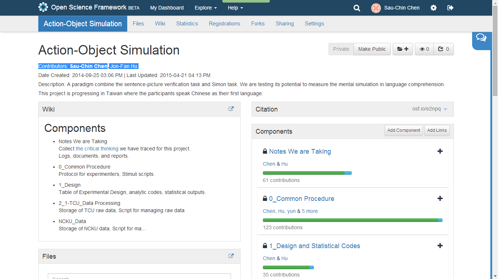

---
## Reproducibile Psychological Research will be nice for

>- Transparency
  + Easy access
  + Smooth workflow
>- Quality and Integrity
  + Peer evaluation
  + Post-published review
  + Making composition and analysis at a pipeline
  + ( Focus on the hypothesis )
>- Teaching and Training
  + Enhance critical thinking
  + Merge concepts and skills
>- ...
