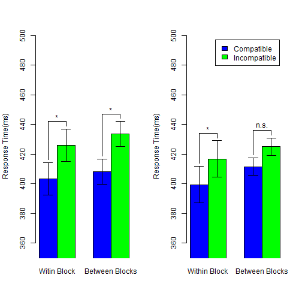

## Outline
1. Why study mental simulation
2. How to measure mental simulation
3. Experiment and findings
4. Reproducibility
</br>
</br>
[Check source files](https://github.com/SCgeeker/ActObj)

--- .dark .segue

## Why study mental simulation?

--- &twocol
## Language Comprehension: Two Perspectives
**Colorless green ideas sleep furiously.**

*** =left


*** =right


*** =pnotes
Standard Cognitive Computation vs. Conceptualized Embodiment</br>

--- &twocol
## Embodied Cognition: How many perspectives?
 |Shapiro(2010) |Rowlands(2010)  
--- | ------------- | --------------  
 |<font color="red">Conceptulization</font>|Embodied mind  
 |Replacement |Enacted mind  
 |Constitution |Extended mind, Embeded mind  


--- .dark .segue

## How to measure mental simulation?

--- 
## Measurements
>- Sentence-picture verification task
  + Matching effect
>- Word color discrimination
  + Compatibility effect (Simon effect)

---
## Sentence-picture verification: Example
>- I want to eat the **egg** in the *dish*.

>- Match the **picture** and **bold word** in next slide.

---
## Sentence-picture verification: Example

   

>- <center>Hardly choose **YES**?</center>  

Is it match?  

1. YES
2. NO


---
## Matching Effects

<!-- html table generated in R 3.1.3 by xtable 1.7-4 package -->
<!-- Sat Jun 20 17:10:42 2015 -->
<table border=1>
<tr> <th>  </th> <th> Match </th> <th> Mismatch </th>  </tr>
  <tr> <td align="center"> RT </td> <td align="center"> 697.00 </td> <td align="center"> 761.00 </td> </tr>
  <tr> <td align="center"> Correct Rate </td> <td align="center"> 97.00 </td> <td align="center"> 93.00 </td> </tr>
   </table>
  
Zwaan, Stanfield, & Yaxley (2002)   
>- Supoort **Perceptual Symbol System**(Barsalou, 1999)  
>- Embodied Simulation Hypothesis: "Perceptual symbols are activated after reading sentence"   

---
## Matching Effects
>- Positive matching effect (Match < Mismatch)
   + shape (Zwaan, Stanfield, and Yaxley, 2002)
   + orientation (Stanfield & Zwaan, 2001)
>- Negative matching effect (Match > Mismatch)
   + color (Connell, 2007)
>- Replication problem
   + Zwaan & Pecher(2012)
   + color > shape > orientation
>- Thinking
   + Sentence-picture verification is a potential tool to inspect language comprehension rather than to inspect embodied cognition
   + ["... I see embodiment as a means and not as an end."](http://rolfzwaan.blogspot.tw/2013/01/reproducing-pencils-and-eagles-but-not.html) (retrieved from Rolf Zwaan's blog, 2013/1/15)


--- &vcenter .large
</br>
</br>
<center><h3>Could we investigate the implicit processing of mental simulation?</h3></center>
</br>
>- <center>There is no standard paradigm to measure the implicit mental simulation.</center>

---
## Extrinsic Affective Simon Task (EAST; De Houwer, 2003)
>- Word meaning classification -> Establish meaning-response compatibility
   + Key 1 = *Happy*   Key 2 = *Disgust*
>- Word color discrimination -> Measure compatibity effect
   + Key 1 = <font color="blue">Color1</font>    Key 2 = <font color="green">Color2</font>
   + Word 1 = *Happy*  Word 2 = *Disgust*
>- Compatible Case
   + Key 1 ~ <font color="blue">*Happy*</font>   Key 2 ~ <font color="green">*Disgust*</font>
>- Incompatible Case
   + Key 1 ~ <font color="blue">*Disgust*</font>   Key 2 ~ <font color="green">*Happy*</font>

---
## Original EAST Results
<!-- html table generated in R 3.1.3 by xtable 1.7-4 package -->
<!-- Sat Jun 20 17:10:42 2015 -->
<table border=1>
<tr> <th>  </th> <th> Word meaning: Happy </th> <th> Word meaning: Disgust </th>  </tr>
  <tr> <td> Compatible Response </td> <td align="right"> 660.00 </td> <td align="right"> 636.00 </td> </tr>
  <tr> <td> Incompatible Response </td> <td align="right"> 707.00 </td> <td align="right"> 678.00 </td> </tr>
   </table>
De Houwer(2003), Experiment 1

---
## Modified EAST Design
>- Word meaning classification 
   + ＞＞＞ Sentence-picture Verification
   + Build **situation** in imagination
>- Word color discrimination 
   + Critical words associated _actions_ and _feelings_
   + Actions and feelings matched the **situation**
>- Two measurements
   + Matching effect: Sentence-picture Verification
   + Compatibility effect: Word color discrimination

---
## Hypothesis
- Embodied Simulation Hypothesis 
  - People comprehend the linguistic forms of objects as the way people **see** the objects in the real world (Bergen, 2012).
  - **see** -> **move**? **observe**?

>- I will **take** this iron box.
>- I will **touch** this iron box.

---
## Situational Properties 
>- **Actions**
   + Observe: have not to exhaust strength
   + Move: have to exhaust strength
>- **Objects**
   + Observed objects generate the feeling about *texture*
   + Moved objects generate the feeling about *weight*
>- **Feelings**
   + Texture
   + Weight

---
## Critical Measurements
>- Matching effect 
   + Which constituents in the situation could be explicit to our imagination?
>- Compatibility effect
   + Which constituents in the situation have the advantage established the implicit association of two unrelated imagination?

---
## Predictions
>- Sentence-picture verification task: human mind would simulate the **action** on the target **object** and the **feeling**.
  + Matching effect would happen to the pitcure that does not match the probe sentence.
>- Word color discrimination task: human mind would process the implicit association of the **action** and the **feeling**.
  + Compatibility effect would happen to the word represented **action** or **feeling** but the color instructed the incompatible response key.

--- .dark .segue

## Experiment and findings

---
## Procedure


---
## Sentence-Picture Verification: Stimuli Sentence


---
## Sentence-Picture Verification: Stimuli Picture


---
## Sentence-Picture Verification: Response keys


---
## Word Color Discrimination: Twist-Tight Pick-Soft


---
## Word Color Discrimination: Twist-Loose Pick-Hard


---
## Word Color Discrimination: Response keys


---
## Analysis protocal
>- Sentence-picture verification
   + Response key sets _X_ Matching
   + All trials in **warm up blocks**
>- Word-color discrimination
   + Three sets of target words: Blue critical, Green critical, Filler
   + Critical words: Word types _X_ Association types _X_ Compatibility
   + Filler words: Word types _X_ Test Blocks _X_ Compatibility

```
## Error in paste0(F1, F2, F3): object 'F1' not found
```

```
## Error in levels(x): object 'F2' not found
```

```
## Error in paste0(F1, F2, F3): object 'F1' not found
```

```
## Error in eval(expr, envir, enclos): object 'F1' not found
```

```
## Error in eval(expr, envir, enclos): object 'F1' not found
```

```
##   Close Jar Grab Sponge Take Cube Open Jar
## C    426.26      387.89    409.75   406.32
## I    454.32      418.79    410.60   444.03
```

--- &twocol
## Sentence-Picture Verification: Summary

*** =left
 

*** =right

 


---
## Sentence-Picture Verification: ANOVA
<!-- html table generated in R 3.1.3 by xtable 1.7-4 package -->
<!-- Sat Jun 20 17:10:45 2015 -->
<table border=1>
<tr> <th>  </th> <th> Df </th> <th> Sum Sq </th> <th> Mean Sq </th> <th> F value </th> <th> Pr(&gt;F) </th>  </tr>
  <tr> <td> Group     </td> <td align="right"> 1 </td> <td align="right"> 685.75 </td> <td align="right"> 685.75 </td> <td align="right"> 0.06 </td> <td align="right"> 0.8053 </td> </tr>
  <tr> <td> Residuals </td> <td align="right"> 38 </td> <td align="right"> 422844.02 </td> <td align="right"> 11127.47 </td> <td align="right">  </td> <td align="right">  </td> </tr>
  <tr> <td> Matching       </td> <td align="right"> 1 </td> <td align="right"> 23780.86 </td> <td align="right"> 23780.86 </td> <td align="right"> 21.38 </td> <td align="right"> 0.0000 </td> </tr>
  <tr> <td> Group:Matching </td> <td align="right"> 1 </td> <td align="right"> 1041.18 </td> <td align="right"> 1041.18 </td> <td align="right"> 0.94 </td> <td align="right"> 0.3394 </td> </tr>
  <tr> <td> Residuals      </td> <td align="right"> 38 </td> <td align="right"> 42267.16 </td> <td align="right"> 1112.29 </td> <td align="right">  </td> <td align="right">  </td> </tr>
  <tr> <td> Action                </td> <td align="right"> 1 </td> <td align="right"> 26980.66 </td> <td align="right"> 26980.66 </td> <td align="right"> 23.92 </td> <td align="right"> 0.0000 </td> </tr>
  <tr> <td> Group:Action          </td> <td align="right"> 1 </td> <td align="right"> 4818.71 </td> <td align="right"> 4818.71 </td> <td align="right"> 4.27 </td> <td align="right"> 0.0422 </td> </tr>
  <tr> <td> Action:Matching       </td> <td align="right"> 1 </td> <td align="right"> 2893.70 </td> <td align="right"> 2893.70 </td> <td align="right"> 2.57 </td> <td align="right"> 0.1134 </td> </tr>
  <tr> <td> Group:Action:Matching </td> <td align="right"> 1 </td> <td align="right"> 3941.22 </td> <td align="right"> 3941.22 </td> <td align="right"> 3.49 </td> <td align="right"> 0.0654 </td> </tr>
  <tr> <td> Residuals             </td> <td align="right"> 76 </td> <td align="right"> 85728.09 </td> <td align="right"> 1128.00 </td> <td align="right">  </td> <td align="right">  </td> </tr>
   </table>

--- &twocol

## Word Color Discrimination: Critical Blue Words

***=left
 

*** =right

 

---

## Word Color Discrimination: Critical Blue Words

<!-- html table generated in R 3.1.3 by xtable 1.7-4 package -->
<!-- Sat Jun 20 17:10:46 2015 -->
<table border=1>
<tr> <th>  </th> <th> Df </th> <th> Sum Sq </th> <th> Mean Sq </th> <th> F value </th> <th> Pr(&gt;F) </th>  </tr>
  <tr> <td> Series    </td> <td align="right"> 1 </td> <td align="right"> 3142.13 </td> <td align="right"> 3142.13 </td> <td align="right"> 0.24 </td> <td align="right"> 0.6281 </td> </tr>
  <tr> <td> Residuals </td> <td align="right"> 38 </td> <td align="right"> 500636.31 </td> <td align="right"> 13174.64 </td> <td align="right">  </td> <td align="right">  </td> </tr>
  <tr> <td> Blocks        </td> <td align="right"> 2 </td> <td align="right"> 1719.47 </td> <td align="right"> 859.74 </td> <td align="right"> 1.37 </td> <td align="right"> 0.2613 </td> </tr>
  <tr> <td> Series:Blocks </td> <td align="right"> 2 </td> <td align="right"> 2740.68 </td> <td align="right"> 1370.34 </td> <td align="right"> 2.18 </td> <td align="right"> 0.1204 </td> </tr>
  <tr> <td> Residuals     </td> <td align="right"> 76 </td> <td align="right"> 47830.48 </td> <td align="right"> 629.35 </td> <td align="right">  </td> <td align="right">  </td> </tr>
  <tr> <td> Compatibility        </td> <td align="right"> 1 </td> <td align="right"> 20370.47 </td> <td align="right"> 20370.47 </td> <td align="right"> 21.78 </td> <td align="right"> 0.0000 </td> </tr>
  <tr> <td> Series:Compatibility </td> <td align="right"> 1 </td> <td align="right"> 6344.47 </td> <td align="right"> 6344.47 </td> <td align="right"> 6.78 </td> <td align="right"> 0.0131 </td> </tr>
  <tr> <td> Residuals            </td> <td align="right"> 38 </td> <td align="right"> 35535.19 </td> <td align="right"> 935.14 </td> <td align="right">  </td> <td align="right">  </td> </tr>
  <tr> <td> Blocks:Compatibility        </td> <td align="right"> 2 </td> <td align="right"> 2905.38 </td> <td align="right"> 1452.69 </td> <td align="right"> 1.78 </td> <td align="right"> 0.1762 </td> </tr>
  <tr> <td> Series:Blocks:Compatibility </td> <td align="right"> 2 </td> <td align="right"> 1648.35 </td> <td align="right"> 824.18 </td> <td align="right"> 1.01 </td> <td align="right"> 0.3698 </td> </tr>
  <tr> <td> Residuals                   </td> <td align="right"> 76 </td> <td align="right"> 62141.54 </td> <td align="right"> 817.65 </td> <td align="right">  </td> <td align="right">  </td> </tr>
   </table>

---

## Word Color Discrimination: Critical Blue Words

*Twist-Tight*
<!-- html table generated in R 3.1.3 by xtable 1.7-4 package -->
<!-- Sat Jun 20 17:10:46 2015 -->
<table border=1>
<tr> <th>  </th> <th> Df </th> <th> Sum Sq </th> <th> Mean Sq </th> <th> F value </th> <th> Pr(&gt;F) </th>  </tr>
  <tr> <td> Residuals </td> <td align="right"> 19 </td> <td align="right"> 154355.93 </td> <td align="right"> 8124.00 </td> <td align="right">  </td> <td align="right">  </td> </tr>
  <tr> <td> Blocks    </td> <td align="right"> 2 </td> <td align="right"> 2480.29 </td> <td align="right"> 1240.15 </td> <td align="right"> 2.33 </td> <td align="right"> 0.1114 </td> </tr>
  <tr> <td> Residuals1 </td> <td align="right"> 38 </td> <td align="right"> 20256.78 </td> <td align="right"> 533.07 </td> <td align="right">  </td> <td align="right">  </td> </tr>
  <tr> <td> Compatibility </td> <td align="right"> 1 </td> <td align="right"> 24725.84 </td> <td align="right"> 24725.84 </td> <td align="right"> 22.65 </td> <td align="right"> 0.0001 </td> </tr>
  <tr> <td> Residuals     </td> <td align="right"> 19 </td> <td align="right"> 20740.84 </td> <td align="right"> 1091.62 </td> <td align="right">  </td> <td align="right">  </td> </tr>
  <tr> <td> Blocks:Compatibility </td> <td align="right"> 2 </td> <td align="right"> 1703.44 </td> <td align="right"> 851.72 </td> <td align="right"> 1.18 </td> <td align="right"> 0.3190 </td> </tr>
  <tr> <td> Residuals            </td> <td align="right"> 38 </td> <td align="right"> 27482.06 </td> <td align="right"> 723.21 </td> <td align="right">  </td> <td align="right">  </td> </tr>
   </table>

*** =pnotes
*Pick-Hard*
<!-- html table generated in R 3.1.3 by xtable 1.7-4 package -->
<!-- Sat Jun 20 17:10:46 2015 -->
<table border=1>
<tr> <th>  </th> <th> Df </th> <th> Sum Sq </th> <th> Mean Sq </th> <th> F value </th> <th> Pr(&gt;F) </th>  </tr>
  <tr> <td> Residuals </td> <td align="right"> 19 </td> <td align="right"> 346280.38 </td> <td align="right"> 18225.28 </td> <td align="right">  </td> <td align="right">  </td> </tr>
  <tr> <td> Blocks    </td> <td align="right"> 2 </td> <td align="right"> 1979.86 </td> <td align="right"> 989.93 </td> <td align="right"> 1.36 </td> <td align="right"> 0.2678 </td> </tr>
  <tr> <td> Residuals1 </td> <td align="right"> 38 </td> <td align="right"> 27573.70 </td> <td align="right"> 725.62 </td> <td align="right">  </td> <td align="right">  </td> </tr>
  <tr> <td> Compatibility </td> <td align="right"> 1 </td> <td align="right"> 1989.10 </td> <td align="right"> 1989.10 </td> <td align="right"> 2.55 </td> <td align="right"> 0.1265 </td> </tr>
  <tr> <td> Residuals     </td> <td align="right"> 19 </td> <td align="right"> 14794.35 </td> <td align="right"> 778.65 </td> <td align="right">  </td> <td align="right">  </td> </tr>
  <tr> <td> Blocks:Compatibility </td> <td align="right"> 2 </td> <td align="right"> 2850.29 </td> <td align="right"> 1425.15 </td> <td align="right"> 1.56 </td> <td align="right"> 0.2228 </td> </tr>
  <tr> <td> Residuals            </td> <td align="right"> 38 </td> <td align="right"> 34659.48 </td> <td align="right"> 912.09 </td> <td align="right">  </td> <td align="right">  </td> </tr>
   </table>

--- &twocol

## Word Color Discrimination: Critical Green Words

*** =left
 

*** =right

 

---

## Word Color Discrimination: Critical Green Words

<!-- html table generated in R 3.1.3 by xtable 1.7-4 package -->
<!-- Sat Jun 20 17:10:48 2015 -->
<table border=1>
<tr> <th>  </th> <th> Df </th> <th> Sum Sq </th> <th> Mean Sq </th> <th> F value </th> <th> Pr(&gt;F) </th>  </tr>
  <tr> <td> Series    </td> <td align="right"> 1 </td> <td align="right"> 363.65 </td> <td align="right"> 363.65 </td> <td align="right"> 0.03 </td> <td align="right"> 0.8662 </td> </tr>
  <tr> <td> Residuals </td> <td align="right"> 38 </td> <td align="right"> 480176.22 </td> <td align="right"> 12636.22 </td> <td align="right">  </td> <td align="right">  </td> </tr>
  <tr> <td> Blocks        </td> <td align="right"> 2 </td> <td align="right"> 1994.90 </td> <td align="right"> 997.45 </td> <td align="right"> 0.96 </td> <td align="right"> 0.3856 </td> </tr>
  <tr> <td> Series:Blocks </td> <td align="right"> 2 </td> <td align="right"> 1099.13 </td> <td align="right"> 549.56 </td> <td align="right"> 0.53 </td> <td align="right"> 0.5898 </td> </tr>
  <tr> <td> Residuals     </td> <td align="right"> 76 </td> <td align="right"> 78563.44 </td> <td align="right"> 1033.73 </td> <td align="right">  </td> <td align="right">  </td> </tr>
  <tr> <td> Compatibility        </td> <td align="right"> 1 </td> <td align="right"> 6538.51 </td> <td align="right"> 6538.51 </td> <td align="right"> 5.68 </td> <td align="right"> 0.0223 </td> </tr>
  <tr> <td> Series:Compatibility </td> <td align="right"> 1 </td> <td align="right"> 2436.51 </td> <td align="right"> 2436.51 </td> <td align="right"> 2.12 </td> <td align="right"> 0.1540 </td> </tr>
  <tr> <td> Residuals            </td> <td align="right"> 38 </td> <td align="right"> 43767.66 </td> <td align="right"> 1151.78 </td> <td align="right">  </td> <td align="right">  </td> </tr>
  <tr> <td> Blocks:Compatibility        </td> <td align="right"> 2 </td> <td align="right"> 262.33 </td> <td align="right"> 131.16 </td> <td align="right"> 0.20 </td> <td align="right"> 0.8171 </td> </tr>
  <tr> <td> Series:Blocks:Compatibility </td> <td align="right"> 2 </td> <td align="right"> 1367.88 </td> <td align="right"> 683.94 </td> <td align="right"> 1.06 </td> <td align="right"> 0.3530 </td> </tr>
  <tr> <td> Residuals                   </td> <td align="right"> 76 </td> <td align="right"> 49233.38 </td> <td align="right"> 647.81 </td> <td align="right">  </td> <td align="right">  </td> </tr>
   </table>

---

## Word Color Discrimination: Critical Green Words

*Pick-Soft*
<!-- html table generated in R 3.1.3 by xtable 1.7-4 package -->
<!-- Sat Jun 20 17:10:49 2015 -->
<table border=1>
<tr> <th>  </th> <th> Df </th> <th> Sum Sq </th> <th> Mean Sq </th> <th> F value </th> <th> Pr(&gt;F) </th>  </tr>
  <tr> <td> Residuals </td> <td align="right"> 19 </td> <td align="right"> 205807.26 </td> <td align="right"> 10831.96 </td> <td align="right">  </td> <td align="right">  </td> </tr>
  <tr> <td> Blocks    </td> <td align="right"> 2 </td> <td align="right"> 2377.97 </td> <td align="right"> 1188.99 </td> <td align="right"> 1.18 </td> <td align="right"> 0.3173 </td> </tr>
  <tr> <td> Residuals1 </td> <td align="right"> 38 </td> <td align="right"> 38179.13 </td> <td align="right"> 1004.71 </td> <td align="right">  </td> <td align="right">  </td> </tr>
  <tr> <td> Compatibility </td> <td align="right"> 1 </td> <td align="right"> 8478.89 </td> <td align="right"> 8478.89 </td> <td align="right"> 8.71 </td> <td align="right"> 0.0082 </td> </tr>
  <tr> <td> Residuals     </td> <td align="right"> 19 </td> <td align="right"> 18500.72 </td> <td align="right"> 973.72 </td> <td align="right">  </td> <td align="right">  </td> </tr>
  <tr> <td> Blocks:Compatibility </td> <td align="right"> 2 </td> <td align="right"> 756.81 </td> <td align="right"> 378.41 </td> <td align="right"> 0.83 </td> <td align="right"> 0.4420 </td> </tr>
  <tr> <td> Residuals            </td> <td align="right"> 38 </td> <td align="right"> 17237.34 </td> <td align="right"> 453.61 </td> <td align="right">  </td> <td align="right">  </td> </tr>
   </table>

*** =pnotes
*Twist-Loose*
<!-- html table generated in R 3.1.3 by xtable 1.7-4 package -->
<!-- Sat Jun 20 17:10:49 2015 -->
<table border=1>
<tr> <th>  </th> <th> Df </th> <th> Sum Sq </th> <th> Mean Sq </th> <th> F value </th> <th> Pr(&gt;F) </th>  </tr>
  <tr> <td> Residuals </td> <td align="right"> 19 </td> <td align="right"> 274368.96 </td> <td align="right"> 14440.47 </td> <td align="right">  </td> <td align="right">  </td> </tr>
  <tr> <td> Blocks    </td> <td align="right"> 2 </td> <td align="right"> 716.05 </td> <td align="right"> 358.03 </td> <td align="right"> 0.34 </td> <td align="right"> 0.7161 </td> </tr>
  <tr> <td> Residuals1 </td> <td align="right"> 38 </td> <td align="right"> 40384.32 </td> <td align="right"> 1062.75 </td> <td align="right">  </td> <td align="right">  </td> </tr>
  <tr> <td> Compatibility </td> <td align="right"> 1 </td> <td align="right"> 496.13 </td> <td align="right"> 496.13 </td> <td align="right"> 0.37 </td> <td align="right"> 0.5486 </td> </tr>
  <tr> <td> Residuals     </td> <td align="right"> 19 </td> <td align="right"> 25266.94 </td> <td align="right"> 1329.84 </td> <td align="right">  </td> <td align="right">  </td> </tr>
  <tr> <td> Blocks:Compatibility </td> <td align="right"> 2 </td> <td align="right"> 873.39 </td> <td align="right"> 436.69 </td> <td align="right"> 0.52 </td> <td align="right"> 0.5995 </td> </tr>
  <tr> <td> Residuals            </td> <td align="right"> 38 </td> <td align="right"> 31996.04 </td> <td align="right"> 842.00 </td> <td align="right">  </td> <td align="right">  </td> </tr>
   </table>

--- &twocol

## Word Color Discrimination: Fillers

*** =left
*Blue*
 

*** =right
*Green*
 

---   

## Word Color Discrimination: Fillers
*Blue*
<!-- html table generated in R 3.1.3 by xtable 1.7-4 package -->
<!-- Sat Jun 20 17:10:51 2015 -->
<table border=1>
<tr> <th>  </th> <th> Df </th> <th> Sum Sq </th> <th> Mean Sq </th> <th> F value </th> <th> Pr(&gt;F) </th>  </tr>
  <tr> <td> F1        </td> <td align="right"> 1 </td> <td align="right"> 882.99 </td> <td align="right"> 882.99 </td> <td align="right"> 0.13 </td> <td align="right"> 0.7231 </td> </tr>
  <tr> <td> Residuals </td> <td align="right"> 38 </td> <td align="right"> 263271.89 </td> <td align="right"> 6928.21 </td> <td align="right">  </td> <td align="right">  </td> </tr>
  <tr> <td> F4        </td> <td align="right"> 1 </td> <td align="right"> 2649.74 </td> <td align="right"> 2649.74 </td> <td align="right"> 2.12 </td> <td align="right"> 0.1536 </td> </tr>
  <tr> <td> F1:F4     </td> <td align="right"> 1 </td> <td align="right"> 177.36 </td> <td align="right"> 177.36 </td> <td align="right"> 0.14 </td> <td align="right"> 0.7085 </td> </tr>
  <tr> <td> Residuals1 </td> <td align="right"> 38 </td> <td align="right"> 47501.87 </td> <td align="right"> 1250.05 </td> <td align="right">  </td> <td align="right">  </td> </tr>
  <tr> <td> F3        </td> <td align="right"> 1 </td> <td align="right"> 15527.56 </td> <td align="right"> 15527.56 </td> <td align="right"> 10.59 </td> <td align="right"> 0.0024 </td> </tr>
  <tr> <td> F1:F3     </td> <td align="right"> 1 </td> <td align="right"> 748.84 </td> <td align="right"> 748.84 </td> <td align="right"> 0.51 </td> <td align="right"> 0.4791 </td> </tr>
  <tr> <td> Residuals2 </td> <td align="right"> 38 </td> <td align="right"> 55692.68 </td> <td align="right"> 1465.60 </td> <td align="right">  </td> <td align="right">  </td> </tr>
  <tr> <td> F4:F3     </td> <td align="right"> 1 </td> <td align="right"> 3.19 </td> <td align="right"> 3.19 </td> <td align="right"> 0.01 </td> <td align="right"> 0.9386 </td> </tr>
  <tr> <td> F1:F4:F3  </td> <td align="right"> 1 </td> <td align="right"> 113.94 </td> <td align="right"> 113.94 </td> <td align="right"> 0.21 </td> <td align="right"> 0.6459 </td> </tr>
  <tr> <td> Residuals3 </td> <td align="right"> 38 </td> <td align="right"> 20180.57 </td> <td align="right"> 531.07 </td> <td align="right">  </td> <td align="right">  </td> </tr>
   </table>

*** =pnotes
*Green*
<!-- html table generated in R 3.1.3 by xtable 1.7-4 package -->
<!-- Sat Jun 20 17:10:51 2015 -->
<table border=1>
<tr> <th>  </th> <th> Df </th> <th> Sum Sq </th> <th> Mean Sq </th> <th> F value </th> <th> Pr(&gt;F) </th>  </tr>
  <tr> <td> F1        </td> <td align="right"> 1 </td> <td align="right"> 73.03 </td> <td align="right"> 73.03 </td> <td align="right"> 0.01 </td> <td align="right"> 0.9234 </td> </tr>
  <tr> <td> Residuals </td> <td align="right"> 38 </td> <td align="right"> 296380.57 </td> <td align="right"> 7799.49 </td> <td align="right">  </td> <td align="right">  </td> </tr>
  <tr> <td> F4        </td> <td align="right"> 1 </td> <td align="right"> 275.57 </td> <td align="right"> 275.57 </td> <td align="right"> 0.20 </td> <td align="right"> 0.6549 </td> </tr>
  <tr> <td> F1:F4     </td> <td align="right"> 1 </td> <td align="right"> 30.31 </td> <td align="right"> 30.31 </td> <td align="right"> 0.02 </td> <td align="right"> 0.8820 </td> </tr>
  <tr> <td> Residuals1 </td> <td align="right"> 38 </td> <td align="right"> 51601.87 </td> <td align="right"> 1357.94 </td> <td align="right">  </td> <td align="right">  </td> </tr>
  <tr> <td> F3        </td> <td align="right"> 1 </td> <td align="right"> 5215.12 </td> <td align="right"> 5215.12 </td> <td align="right"> 8.53 </td> <td align="right"> 0.0058 </td> </tr>
  <tr> <td> F1:F3     </td> <td align="right"> 1 </td> <td align="right"> 793.93 </td> <td align="right"> 793.93 </td> <td align="right"> 1.30 </td> <td align="right"> 0.2615 </td> </tr>
  <tr> <td> Residuals2 </td> <td align="right"> 38 </td> <td align="right"> 23222.68 </td> <td align="right"> 611.12 </td> <td align="right">  </td> <td align="right">  </td> </tr>
  <tr> <td> F4:F3     </td> <td align="right"> 1 </td> <td align="right"> 547.02 </td> <td align="right"> 547.02 </td> <td align="right"> 1.35 </td> <td align="right"> 0.2528 </td> </tr>
  <tr> <td> F1:F4:F3  </td> <td align="right"> 1 </td> <td align="right"> 150.39 </td> <td align="right"> 150.39 </td> <td align="right"> 0.37 </td> <td align="right"> 0.5462 </td> </tr>
  <tr> <td> Residuals3 </td> <td align="right"> 38 </td> <td align="right"> 15415.95 </td> <td align="right"> 405.68 </td> <td align="right">  </td> <td align="right">  </td> </tr>
   </table>

---

## Summary
>- Sentence-picture Verification
  + Action exhausted strength: Positive for **Tight**; Negative for **Loose**
  + Action exhausted nothing: Positive Matching Effects
>- Word Color Discrimination
  + Critical words connected to the action exhausted strenght: Positive compatibility effect but limited to **Close - Tight**
  + Critical words connected to the action exhausted nothing: Null compatibility effects but tend to negative
  + Filler words: Repetition failed to cause compatibility effects
  
---

## Implications
- Two aspects of embodied simulation effect
 1. Explicit: Human minds process the surface of imagination/mental simulation.
 2. Implicit: Human minds process the ingrideints under imagination/mental simulation.
</br>
</br>
</br>
</br>
<center><h3>Welcome your critical comments.</h3></center>

--- &vcenter

</br>

</br>

<center><h1>A Practical Reproducible Research</h1></center>

---
## Replication versus Reproduction

>- Academic society hardly define the standards for replication.

>- Sharing codes is the universal standard for reproduction.


---
## Workflow of Psychological Research
</br>
<center><h3>Suggest Hypothesis -> Design -> Collect Data -> Analyze Data -> Report</h3></center>

---
## Workflow of Psychological Research
**Replication**
<center><h3>Suggest Hypothesis -> <font color="red">Design -> Collect Data -> Analyze Data -> Report</font></h3></center>

>- Participants
>- Instruments
>- Experimental Codes
>- Analytical Codes

---
## Workflow of Psychological Research
**Reproduction**
<center><h3>Suggest Hypothesis -> Design -> Collect Data -> <font color="red">Analyze Data -> Report -> Post Review</b></font></center>

>- Analytical Codes
  + Cleaned data (Readable format, Codebook)
  + Programming codes (R, SAS, SPSS, Matlab, ...)

---
## You are watching a reproducible research case

- Share raw and cleaned data <- unavailable at this time
- Share stimulus <- review the previous slides
- Share analytical codes <- [Check my github](https://github.com/SCgeeker/ActObj)

```r
#Tidy data of sentence-picture verification
AB_DATA <- read.table("../AB.csv",head=T,sep=",")
#Tidy data of word color discrimination
T_DATA <- read.table("../TEST.csv",head=T,sep=",")
# statistical figure
SP_RT1 <- barplot2(
   SP_RT_M[,c(1,4)], beside=T,xpd=F,
    ylim = c(350,550),ylab="Response Time(ms)",
    col = c(rep(c("black","white"),2)), plot.ci = TRUE, 
    ci.l = (SP_RT_M[,c(1,4)] - SP_RTse_M[,c(1,4)]), 
    ci.u = (SP_RT_M[,c(1,4)] + SP_RTse_M[,c(1,4)]),
    panel.first = TRUE )
```

---
## Preview our repository
[Anonymous preview](https://osf.io/gqf8k/?view_only=9a77fe9b5c4542ceb09bf759105fae03)</br>


---
## Reproducibile Psychological Research will be nice for

>- Transparency
  + Easy access
  + Smooth workflow
>- Quality and Integrity
  + Peer evaluation
  + Post-published review
  + Making composition and analysis at a pipeline
  + ( Focus on the hypothesis )
>- Teaching and Training
  + Enhance critical thinking
  + Merge concepts and skills
>- ...
