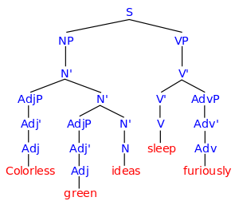
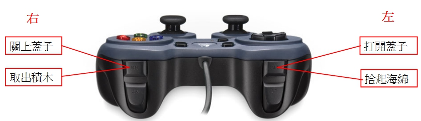
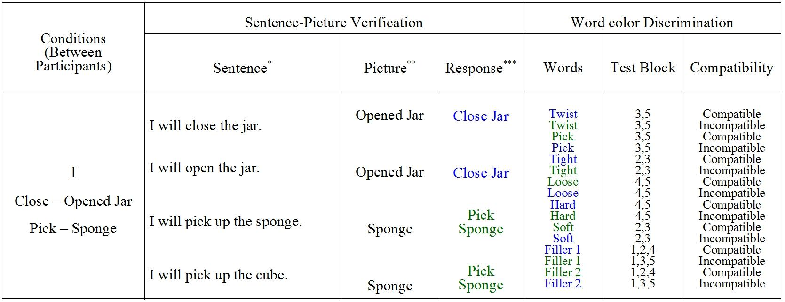
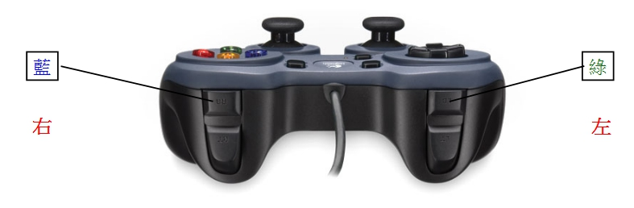
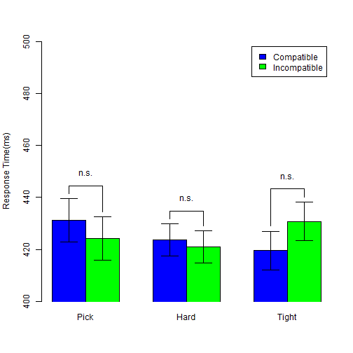
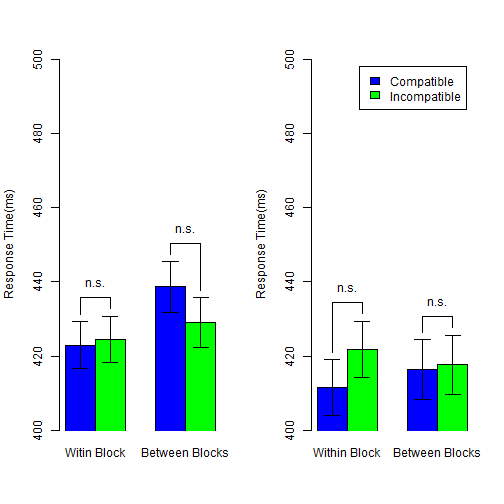

## Outline
1. Why study mental simulation
2. How to measure mental simulation
3. Experiment and findings
4. Reproducibility


[See source files](https://github.com/SCgeeker/ActObj)

--- .dark .segue

## Why study mental simulation?

--- &twocol
## Why?
**Colorless green ideas sleep furiously.**

*** =left


*** =right


*** =pnotes
Standard Cognitive Computation vs. Conceptualized Embodiment

--- &twocol
## How many perspectives?
 |Shapiro(2010) |Rowlands(2010)  
--- | ------------- | --------------  
 |<font color="red">Conceptulization</font>|Embodied mind  
 |Replacement |Enacted mind  
 |Constitution |Extended mind, Embeded mind  


--- .dark .segue

## How to measure mental simulation?

--- 
## Measurements
>- Sentence-picture verification task
  + Matching effect
>- Word color discrimination
  + Compatibility effect (Simon effect)

---
## Sentence-picture verification: Example
>- I want to eat the **egg** in the *dish*.

>- Match the **picture** and **bold word** in next slide.

---
## Sentence-picture verification: Example

   

>- <center>Hardly choose **YES**?</center>  

Is it match?  

1. YES
2. NO


---
## Matching Effects

<!-- html table generated in R 3.1.3 by xtable 1.7-4 package -->
<!-- Tue Apr 21 16:43:08 2015 -->
<table border=1>
<tr> <th>  </th> <th> Match </th> <th> Mismatch </th>  </tr>
  <tr> <td align="center"> RT </td> <td align="center"> 697.00 </td> <td align="center"> 761.00 </td> </tr>
  <tr> <td align="center"> Correct Rate </td> <td align="center"> 97.00 </td> <td align="center"> 93.00 </td> </tr>
   </table>
  
Zwaan, Stanfield, & Yaxley (2002)   
>- Embodied Simulation Hypothesis: "Perceptual symbols are activated after reading sentence"   
>- Supoort **Perceptual Symbol System**(Barsalou, 1999)

---
## Matching Effects
>- Positive matching effect (Match < Mismatch)
   + shape (Zwaan, Stanfield, and Yaxley, 2002)
   + orientation (Stanfield & Zwaan, 2001)
>- Negative matching effect (Match > Mismatch)
   + color (Connell, 2007)
>- Replication problem
   + Zwaan & Pecher(2012)
   + color > shape > orientation
>- Thinking
   + Sentence-picture verification is a potential tool to inspect language comprehension rather than to inspect embodied cognition
   + ["... I see embodiment as a means and not as an end."](http://rolfzwaan.blogspot.tw/2013/01/reproducing-pencils-and-eagles-but-not.html) (retrieved from Rolf Zwaan's blog, 2013/1/15)


--- &vcenter .large
</br>
</br>
<center><h3>Could we investigate the implicit processing of mental simulation?</h3></center>
</br>
>- <center>There is no standard paradigm to measure the implicit mental simulation.</center>

---
## Extrinsic Affective Simon Task (EAST; De Houwer, 2003)
>- Word meaning classification -> Establish meaning-response compatibility
   + Key 1 = *Happy*   Key 2 = *Disgust*
>- Word color discrimination -> Measure compatibity effect
   + Key 1 = <font color="blue">Color1</font>    Key 2 = <font color="green">Color2</font>
   + Word 1 = *Happy*  Word 2 = *Disgust*
>- Compatible Case
   + Key 1 ~ <font color="blue">*Happy*</font>   Key 2 ~ <font color="green">*Disgust*</font>
>- Incompatible Case
   + Key 1 ~ <font color="blue">*Disgust*</font>   Key 2 ~ <font color="green">*Happy*</font>

---
## Original EAST Results
<!-- html table generated in R 3.1.3 by xtable 1.7-4 package -->
<!-- Tue Apr 21 16:43:08 2015 -->
<table border=1>
<tr> <th>  </th> <th> Word meaning: Happy </th> <th> Word meaning: Disgust </th>  </tr>
  <tr> <td> Compatible Response </td> <td align="right"> 660.00 </td> <td align="right"> 636.00 </td> </tr>
  <tr> <td> Incompatible Response </td> <td align="right"> 707.00 </td> <td align="right"> 678.00 </td> </tr>
   </table>
De Houwer(2003), Experiment 1

---
## Modified EAST Design
>- Word meaning classification 
   + ＞＞ Sentence-picture Verification
   + Build **situation** in imagination
>- Word color discrimination 
   + Critical words associated _actions_ and _feelings_
   + Actions and feelings matched the **situation**
>- Two measurements
   + Matching effect: Sentence-picture Verification
   + Compatibility effect: Word color discrimination

---
## Hypothesis
- Embodied Simulation Hypothesis 
  - People comprehend the linguistic forms of objects as the way people **see** the objects in the real world (Bergen, 2012).
  - **see** -> **move**? **observe**?

>- I will **take** this iron box.
>- I will **touch** this iron box.

---
## Situational Properties 
>- **Actions**
   + Observe: have not to exhaust strength
   + Move: have to exhaust strength
>- **Objects**
   + Observed objects generate the feeling about *texture*
   + Moved objects generate the feeling about *weight*
>- **Feelings**
   + Texture
   + Weight

---
## Critical Measurements
>- Matching effect 
   + Which constituents in the situation could be explicit to our imagination?
>- Compatibility effect
   + Which constituents in the situation have the advantage established the implicit association of two unrelated imagination?

---
## Predictions
>- Sentence-picture verification task: human mind would simulate the **action** on the target **object** and the **feeling**.
  + Matching effect would happen to the pitcure that does not match the probe sentence.
>- Word color discrimination task: human mind would process the implicit association of the **action** and the **feeling**.
  + Compatibility effect would happen to the word represented **action** or **feeling** but the color instructed the incompatible response key.

--- .dark .segue

## Experiment and findings

---
## Procedure


---
## Sentence-Picture Verification: Stimuli Sentence


---
## Sentence-Picture Verification: Stimuli Picture


---
## Sentence-Picture Verification: Response keys


---
## Word Color Discrimination: Twist-Tight Pick-Loose


---
## Word Color Discrimination: Twist-Loose Pick-Tight


---
## Word Color Discrimination: Response keys


---
## Analysis protocal
>- Sentence-picture verification
   + Response key sets _X_ Matching
   + All trials in **warm up blocks**
>- Word-color discrimination
   + Three sets of target words: Blue critical, Green critical, Filler
   + Critical words: Word types _X_ Association types _X_ Compatibility
   + Filler words: Word types _X_ Test Blocks _X_ Compatibility


--- &twocol
## Sentence-Picture Verification: Summary

*** =left
 

*** =right

 


---
## Sentence-Picture Verification: ANOVA
<!-- html table generated in R 3.1.3 by xtable 1.7-4 package -->
<!-- Tue Apr 21 16:43:10 2015 -->
<table border=1>
<tr> <th>  </th> <th> Df </th> <th> Sum Sq </th> <th> Mean Sq </th> <th> F value </th> <th> Pr(&gt;F) </th>  </tr>
  <tr> <td> Series    </td> <td align="right"> 1 </td> <td align="right"> 95736.35 </td> <td align="right"> 95736.35 </td> <td align="right"> 2.41 </td> <td align="right"> 0.1290 </td> </tr>
  <tr> <td> Residuals </td> <td align="right"> 38 </td> <td align="right"> 1510458.39 </td> <td align="right"> 39748.91 </td> <td align="right">  </td> <td align="right">  </td> </tr>
  <tr> <td> Matching        </td> <td align="right"> 1 </td> <td align="right"> 10475.54 </td> <td align="right"> 10475.54 </td> <td align="right"> 14.68 </td> <td align="right"> 0.0005 </td> </tr>
  <tr> <td> Series:Matching </td> <td align="right"> 1 </td> <td align="right"> 6464.75 </td> <td align="right"> 6464.75 </td> <td align="right"> 9.06 </td> <td align="right"> 0.0046 </td> </tr>
  <tr> <td> Residuals       </td> <td align="right"> 38 </td> <td align="right"> 27112.52 </td> <td align="right"> 713.49 </td> <td align="right">  </td> <td align="right">  </td> </tr>
  <tr> <td> Situation          </td> <td align="right"> 2 </td> <td align="right"> 42157.54 </td> <td align="right"> 21078.77 </td> <td align="right"> 9.92 </td> <td align="right"> 0.0001 </td> </tr>
  <tr> <td> Situation:Matching </td> <td align="right"> 2 </td> <td align="right"> 5375.40 </td> <td align="right"> 2687.70 </td> <td align="right"> 1.26 </td> <td align="right"> 0.2882 </td> </tr>
  <tr> <td> Residuals          </td> <td align="right"> 76 </td> <td align="right"> 161522.57 </td> <td align="right"> 2125.30 </td> <td align="right">  </td> <td align="right">  </td> </tr>
   </table>

--- &twocol

## Word Color Discrimination: Critical Blue Words

***=left
 

*** =right

 

---

## Word Color Discrimination: Critical Blue Words

<!-- html table generated in R 3.1.3 by xtable 1.7-4 package -->
<!-- Tue Apr 21 16:43:11 2015 -->
<table border=1>
<tr> <th>  </th> <th> Df </th> <th> Sum Sq </th> <th> Mean Sq </th> <th> F value </th> <th> Pr(&gt;F) </th>  </tr>
  <tr> <td> Series    </td> <td align="right"> 1 </td> <td align="right"> 1024.30 </td> <td align="right"> 1024.30 </td> <td align="right"> 0.08 </td> <td align="right"> 0.7765 </td> </tr>
  <tr> <td> Residuals </td> <td align="right"> 38 </td> <td align="right"> 475950.76 </td> <td align="right"> 12525.02 </td> <td align="right">  </td> <td align="right">  </td> </tr>
  <tr> <td> Blocks        </td> <td align="right"> 2 </td> <td align="right"> 142.89 </td> <td align="right"> 71.45 </td> <td align="right"> 0.12 </td> <td align="right"> 0.8898 </td> </tr>
  <tr> <td> Series:Blocks </td> <td align="right"> 2 </td> <td align="right"> 870.87 </td> <td align="right"> 435.44 </td> <td align="right"> 0.71 </td> <td align="right"> 0.4937 </td> </tr>
  <tr> <td> Residuals     </td> <td align="right"> 76 </td> <td align="right"> 46449.99 </td> <td align="right"> 611.18 </td> <td align="right">  </td> <td align="right">  </td> </tr>
  <tr> <td> Compatibility        </td> <td align="right"> 1 </td> <td align="right"> 3090.63 </td> <td align="right"> 3090.63 </td> <td align="right"> 5.26 </td> <td align="right"> 0.0274 </td> </tr>
  <tr> <td> Series:Compatibility </td> <td align="right"> 1 </td> <td align="right"> 2652.66 </td> <td align="right"> 2652.66 </td> <td align="right"> 4.52 </td> <td align="right"> 0.0401 </td> </tr>
  <tr> <td> Residuals            </td> <td align="right"> 38 </td> <td align="right"> 22317.72 </td> <td align="right"> 587.31 </td> <td align="right">  </td> <td align="right">  </td> </tr>
  <tr> <td> Blocks:Compatibility        </td> <td align="right"> 2 </td> <td align="right"> 422.98 </td> <td align="right"> 211.49 </td> <td align="right"> 0.42 </td> <td align="right"> 0.6594 </td> </tr>
  <tr> <td> Series:Blocks:Compatibility </td> <td align="right"> 2 </td> <td align="right"> 1705.32 </td> <td align="right"> 852.66 </td> <td align="right"> 1.69 </td> <td align="right"> 0.1917 </td> </tr>
  <tr> <td> Residuals                   </td> <td align="right"> 76 </td> <td align="right"> 38384.34 </td> <td align="right"> 505.06 </td> <td align="right">  </td> <td align="right">  </td> </tr>
   </table>

---

## Word Color Discrimination: Critical Blue Words

*Twist-Tight*
<!-- html table generated in R 3.1.3 by xtable 1.7-4 package -->
<!-- Tue Apr 21 16:43:11 2015 -->
<table border=1>
<tr> <th>  </th> <th> Df </th> <th> Sum Sq </th> <th> Mean Sq </th> <th> F value </th> <th> Pr(&gt;F) </th>  </tr>
  <tr> <td> Residuals </td> <td align="right"> 19 </td> <td align="right"> 259684.77 </td> <td align="right"> 13667.62 </td> <td align="right">  </td> <td align="right">  </td> </tr>
  <tr> <td> Blocks    </td> <td align="right"> 2 </td> <td align="right"> 436.86 </td> <td align="right"> 218.43 </td> <td align="right"> 0.55 </td> <td align="right"> 0.5788 </td> </tr>
  <tr> <td> Residuals1 </td> <td align="right"> 38 </td> <td align="right"> 14963.12 </td> <td align="right"> 393.77 </td> <td align="right">  </td> <td align="right">  </td> </tr>
  <tr> <td> Compatibility </td> <td align="right"> 1 </td> <td align="right"> 5734.93 </td> <td align="right"> 5734.93 </td> <td align="right"> 7.34 </td> <td align="right"> 0.0139 </td> </tr>
  <tr> <td> Residuals     </td> <td align="right"> 19 </td> <td align="right"> 14851.81 </td> <td align="right"> 781.67 </td> <td align="right">  </td> <td align="right">  </td> </tr>
  <tr> <td> Blocks:Compatibility </td> <td align="right"> 2 </td> <td align="right"> 311.75 </td> <td align="right"> 155.88 </td> <td align="right"> 0.39 </td> <td align="right"> 0.6804 </td> </tr>
  <tr> <td> Residuals            </td> <td align="right"> 38 </td> <td align="right"> 15227.24 </td> <td align="right"> 400.72 </td> <td align="right">  </td> <td align="right">  </td> </tr>
   </table>

*** =pnotes
*Pick-Hard*
<!-- html table generated in R 3.1.3 by xtable 1.7-4 package -->
<!-- Tue Apr 21 16:43:11 2015 -->
<table border=1>
<tr> <th>  </th> <th> Df </th> <th> Sum Sq </th> <th> Mean Sq </th> <th> F value </th> <th> Pr(&gt;F) </th>  </tr>
  <tr> <td> Residuals </td> <td align="right"> 19 </td> <td align="right"> 216265.99 </td> <td align="right"> 11382.42 </td> <td align="right">  </td> <td align="right">  </td> </tr>
  <tr> <td> Blocks    </td> <td align="right"> 2 </td> <td align="right"> 576.90 </td> <td align="right"> 288.45 </td> <td align="right"> 0.35 </td> <td align="right"> 0.7082 </td> </tr>
  <tr> <td> Residuals1 </td> <td align="right"> 38 </td> <td align="right"> 31486.87 </td> <td align="right"> 828.60 </td> <td align="right">  </td> <td align="right">  </td> </tr>
  <tr> <td> Compatibility </td> <td align="right"> 1 </td> <td align="right"> 8.36 </td> <td align="right"> 8.36 </td> <td align="right"> 0.02 </td> <td align="right"> 0.8856 </td> </tr>
  <tr> <td> Residuals     </td> <td align="right"> 19 </td> <td align="right"> 7465.91 </td> <td align="right"> 392.94 </td> <td align="right">  </td> <td align="right">  </td> </tr>
  <tr> <td> Blocks:Compatibility </td> <td align="right"> 2 </td> <td align="right"> 1816.55 </td> <td align="right"> 908.27 </td> <td align="right"> 1.49 </td> <td align="right"> 0.2381 </td> </tr>
  <tr> <td> Residuals            </td> <td align="right"> 38 </td> <td align="right"> 23157.10 </td> <td align="right"> 609.40 </td> <td align="right">  </td> <td align="right">  </td> </tr>
   </table>

--- &twocol

## Word Color Discrimination: Critical Green Words

*** =left
 

*** =right

 

---

## Word Color Discrimination: Critical Green Words

<!-- html table generated in R 3.1.3 by xtable 1.7-4 package -->
<!-- Tue Apr 21 16:43:12 2015 -->
<table border=1>
<tr> <th>  </th> <th> Df </th> <th> Sum Sq </th> <th> Mean Sq </th> <th> F value </th> <th> Pr(&gt;F) </th>  </tr>
  <tr> <td> Series    </td> <td align="right"> 1 </td> <td align="right"> 685.34 </td> <td align="right"> 685.34 </td> <td align="right"> 0.06 </td> <td align="right"> 0.8106 </td> </tr>
  <tr> <td> Residuals </td> <td align="right"> 38 </td> <td align="right"> 447052.88 </td> <td align="right"> 11764.55 </td> <td align="right">  </td> <td align="right">  </td> </tr>
  <tr> <td> Blocks        </td> <td align="right"> 2 </td> <td align="right"> 536.44 </td> <td align="right"> 268.22 </td> <td align="right"> 0.33 </td> <td align="right"> 0.7174 </td> </tr>
  <tr> <td> Series:Blocks </td> <td align="right"> 2 </td> <td align="right"> 138.77 </td> <td align="right"> 69.39 </td> <td align="right"> 0.09 </td> <td align="right"> 0.9174 </td> </tr>
  <tr> <td> Residuals     </td> <td align="right"> 76 </td> <td align="right"> 61104.07 </td> <td align="right"> 804.00 </td> <td align="right">  </td> <td align="right">  </td> </tr>
  <tr> <td> Compatibility        </td> <td align="right"> 1 </td> <td align="right"> 2744.42 </td> <td align="right"> 2744.42 </td> <td align="right"> 4.49 </td> <td align="right"> 0.0408 </td> </tr>
  <tr> <td> Series:Compatibility </td> <td align="right"> 1 </td> <td align="right"> 59.55 </td> <td align="right"> 59.55 </td> <td align="right"> 0.10 </td> <td align="right"> 0.7567 </td> </tr>
  <tr> <td> Residuals            </td> <td align="right"> 38 </td> <td align="right"> 23247.56 </td> <td align="right"> 611.78 </td> <td align="right">  </td> <td align="right">  </td> </tr>
  <tr> <td> Blocks:Compatibility        </td> <td align="right"> 2 </td> <td align="right"> 13.40 </td> <td align="right"> 6.70 </td> <td align="right"> 0.01 </td> <td align="right"> 0.9885 </td> </tr>
  <tr> <td> Series:Blocks:Compatibility </td> <td align="right"> 2 </td> <td align="right"> 1459.45 </td> <td align="right"> 729.73 </td> <td align="right"> 1.26 </td> <td align="right"> 0.2888 </td> </tr>
  <tr> <td> Residuals                   </td> <td align="right"> 76 </td> <td align="right"> 43931.35 </td> <td align="right"> 578.04 </td> <td align="right">  </td> <td align="right">  </td> </tr>
   </table>

---

## Word Color Discrimination: Critical Green Words

*Pick-Soft*
<!-- html table generated in R 3.1.3 by xtable 1.7-4 package -->
<!-- Tue Apr 21 16:43:13 2015 -->
<table border=1>
<tr> <th>  </th> <th> Df </th> <th> Sum Sq </th> <th> Mean Sq </th> <th> F value </th> <th> Pr(&gt;F) </th>  </tr>
  <tr> <td> Residuals </td> <td align="right"> 19 </td> <td align="right"> 238706.63 </td> <td align="right"> 12563.51 </td> <td align="right">  </td> <td align="right">  </td> </tr>
  <tr> <td> Blocks    </td> <td align="right"> 2 </td> <td align="right"> 285.42 </td> <td align="right"> 142.71 </td> <td align="right"> 0.17 </td> <td align="right"> 0.8407 </td> </tr>
  <tr> <td> Residuals1 </td> <td align="right"> 38 </td> <td align="right"> 31106.81 </td> <td align="right"> 818.60 </td> <td align="right">  </td> <td align="right">  </td> </tr>
  <tr> <td> Compatibility </td> <td align="right"> 1 </td> <td align="right"> 1806.26 </td> <td align="right"> 1806.26 </td> <td align="right"> 2.37 </td> <td align="right"> 0.1405 </td> </tr>
  <tr> <td> Residuals     </td> <td align="right"> 19 </td> <td align="right"> 14508.25 </td> <td align="right"> 763.59 </td> <td align="right">  </td> <td align="right">  </td> </tr>
  <tr> <td> Blocks:Compatibility </td> <td align="right"> 2 </td> <td align="right"> 868.34 </td> <td align="right"> 434.17 </td> <td align="right"> 1.01 </td> <td align="right"> 0.3745 </td> </tr>
  <tr> <td> Residuals            </td> <td align="right"> 38 </td> <td align="right"> 16366.25 </td> <td align="right"> 430.69 </td> <td align="right">  </td> <td align="right">  </td> </tr>
   </table>

*** =pnotes
*Twist-Loose*
<!-- html table generated in R 3.1.3 by xtable 1.7-4 package -->
<!-- Tue Apr 21 16:43:13 2015 -->
<table border=1>
<tr> <th>  </th> <th> Df </th> <th> Sum Sq </th> <th> Mean Sq </th> <th> F value </th> <th> Pr(&gt;F) </th>  </tr>
  <tr> <td> Residuals </td> <td align="right"> 19 </td> <td align="right"> 208346.24 </td> <td align="right"> 10965.59 </td> <td align="right">  </td> <td align="right">  </td> </tr>
  <tr> <td> Blocks    </td> <td align="right"> 2 </td> <td align="right"> 389.80 </td> <td align="right"> 194.90 </td> <td align="right"> 0.25 </td> <td align="right"> 0.7825 </td> </tr>
  <tr> <td> Residuals1 </td> <td align="right"> 38 </td> <td align="right"> 29997.26 </td> <td align="right"> 789.40 </td> <td align="right">  </td> <td align="right">  </td> </tr>
  <tr> <td> Compatibility </td> <td align="right"> 1 </td> <td align="right"> 997.71 </td> <td align="right"> 997.71 </td> <td align="right"> 2.17 </td> <td align="right"> 0.1572 </td> </tr>
  <tr> <td> Residuals     </td> <td align="right"> 19 </td> <td align="right"> 8739.31 </td> <td align="right"> 459.96 </td> <td align="right">  </td> <td align="right">  </td> </tr>
  <tr> <td> Blocks:Compatibility </td> <td align="right"> 2 </td> <td align="right"> 604.51 </td> <td align="right"> 302.26 </td> <td align="right"> 0.42 </td> <td align="right"> 0.6622 </td> </tr>
  <tr> <td> Residuals            </td> <td align="right"> 38 </td> <td align="right"> 27565.09 </td> <td align="right"> 725.40 </td> <td align="right">  </td> <td align="right">  </td> </tr>
   </table>

--- &twocol

## Word Color Discrimination: Fillers

*** =left
*Blue*
 

*** =right
*Green*
 

---
## Summary
>- Sentence-picture Verification
  + Action exhausted strength: Positive for **Tight**; Negative for **Loose**
  + Action exhausted nothing: Positive Matching Effects
>- Word Color Discrimination
  + Critical words connected to the action exhausted strenght: Positive compatibility effect but limited to **Close - Tight**
  + Critical words connected to the action exhausted nothing: Null compatibility effects but tend to negative
  + Filler words: Repetition failed to cause compatibility effects

---
## Implications
- Two aspects of embodied simulation effect
 1. Explicit: Human minds process the surface of imagination/mental simulation.
 2. Implicit: Human minds process the ingrideints under imagination/mental simulation.
</br>
</br>
</br>
</br>
<center><h3>Welcome your critical comments.</h3></center>

--- &vcenter

</br>

</br>

<center><h1>A Practical Reproducible Research</h1></center>

---
## Replication versus Reproduction

>- Academic society hardly define the standards for replication.

>- Sharing codes is the universal standard for reproduction.


---
## Workflow of Psychological Research
</br>
<center><h3>Suggest Hypothesis -> Design -> Collect Data -> Analyze Data -> Report</h3></center>

---
## Workflow of Psychological Research
**Replication**
<center><h3>Suggest Hypothesis -> <font color="red">Design -> Collect Data -> Analyze Data -> Report</font></h3></center>

>- Participants
>- Instruments
>- Experimental Codes
>- Analytical Codes

---
## Workflow of Psychological Research
**Reproduction**
<center><h3>Suggest Hypothesis -> Design -> Collect Data -> <font color="red">Analyze Data -> Report -> Post Review</b></font></center>

>- Analytical Codes
  + Cleaned data (Readable format, Codebook)
  + Programming codes (R, SAS, SPSS, Matlab, ...)

---
## You are watching a reproducible research case

- Share raw and cleaned data <- unavailable at this time
- Share stimulus <- review the previous slides
- Share analytical codes <- [Check my github](https://github.com/SCgeeker/ActObj)

```r
#Tidy data of sentence-picture verification
AB_DATA <- read.table("../AB.csv",head=T,sep=",")
#Tidy data of word color discrimination
T_DATA <- read.table("../TEST.csv",head=T,sep=",")
# statistical figure
SP_RT1 <- barplot2(
   SP_RT_M[,c(1,4)], beside=T,xpd=F,
    ylim = c(350,550),ylab="Response Time(ms)",
    col = c(rep(c("black","white"),2)), plot.ci = TRUE, 
    ci.l = (SP_RT_M[,c(1,4)] - SP_RTse_M[,c(1,4)]), 
    ci.u = (SP_RT_M[,c(1,4)] + SP_RTse_M[,c(1,4)]),
    panel.first = TRUE )
```

---
## Preview our repository
[Anonymous preview](https://osf.io/gqf8k/?view_only=9a77fe9b5c4542ceb09bf759105fae03)</br>


---
## Reproducibile Psychological Research will be nice for

>- Transparency
  + Easy access
  + Smooth workflow
>- Quality and Integrity
  + Peer evaluation
  + Post-published review
  + Making composition and analysis at a pipeline
  + ( Focus on the hypothesis )
>- Teaching and Training
  + Enhance critical thinking
  + Merge concepts and skills
>- ...
