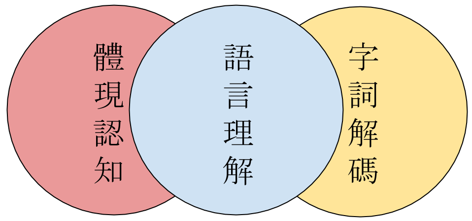
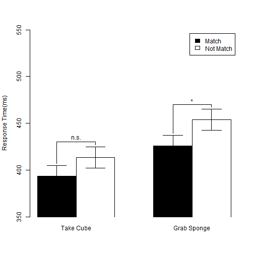

## Outline
1. A big picture <font color="green"><b>5 %</b></font>
2. Word decoding: Timeline of my studies <font color="green"><b>12.5 %</b></font>
3. Embodied cognition: Measure mental simulation <font color="green"><b>55 %</b></font>
4. Open science  <font color="green"><b>27.5 %</b></font>
</br>
[See source files](https://github.com/SCgeeker/ActObj2014/tree/master)  
</br>
[My Academia](https://tzuchi.academia.edu/SauChinChen)

---  .segue .dark

## A big picture

---
</br>
</img>

---  .segue .dark

## Word decoding: Timeline of my studies

--- 
## Past
>- Compound character (像、經)
 + Regularity and Consistency effects
 + Two mental functions to acqurie and process the orthography-phonology correspondences.

>- Compound word (真實、假設)
 + Masked repetition and word frequency interaction
 + Early processing of constituent characters versus Reduced processing of whole word

---
## Today
>- Orthography of Chinese characters
 + What are samllest radicals to describe traditional and simplified Chinese characters?

>- Morphology of Chinese compound words
 + What are quantitative and qualitative aspects of compounds/constituents?

>- Data science approach
 + Search engine for multipe databases (Corpus, Mega studies, ...)
 + Toolbox to design a word processing study

---
## Mental Lexical Entry Project: Framework
</img>
- Primary goal: Direct mapping traditational and simplified Chinese characters.

---
## Mental Lexical Entry Project: Applications
>- For Researchers
  + Use one key number access multiple databases.
>- For Tutors
  + Accumulate students' records
  + Evidence based suggestions
>- For Students
  + Converge materials across scripts.
  + Fit the individual learning curve.

---  .segue .dark

## Embodied cognition: Measure mental simulation

--- &twocol
## Why?
**Colorless green ideas sleep furiously.**

*** =left
</img>

*** =right
</img>

*** =pnotes
Standard Cognitive Science vs. Conceptualized Embodiment


--- &twocol
## How many perspectives?
  
 |Shapiro(2010) |Rowlands(2010)  
--- | ------------- | --------------  
 |<font color="red">Conceptulization</font>|Embodied mind  
 |Replacement |Enacted mind  
 |Constitution |Extended mind, Embeded mind  

</img>


---
## How to measure mental simulation?
>- Sentence-picture verification task
  + Matching effect
>- Word color discrimination
  + Compatibility effect (Simon effect)

---
## Sentence-picture verification: Example
>- 我想吃盤子裡的**蛋**.

>- 檢查下一張簡報的**圖**是否符合粗體字標示的詞.

---
## Sentence-picture verification: Example

</img>

符合嗎?

1. YES
2. NO

*** =pnotes

Hardly choose **YES**?

---
## Matching Effects

<!-- html table generated in R 3.1.3 by xtable 1.7-4 package -->
<!-- Thu Apr 09 16:49:48 2015 -->
<table border=1>
<tr> <th>  </th> <th> Match </th> <th> Mismatch </th>  </tr>
  <tr> <td align="center"> RT </td> <td align="center"> 697.00 </td> <td align="center"> 761.00 </td> </tr>
  <tr> <td align="center"> Correct Rate </td> <td align="center"> 97.00 </td> <td align="center"> 93.00 </td> </tr>
   </table>
  
Zwaan, Stanfield, & Yaxley (2002)   
>- Embodied Simulation Hypothesis: "Perceptual symbols are activated after reading sentence"   
>- Supoort **Perceptual Symbol System**(Barsalou, 1999)

---
## Matching Effects
>- Positive matching effect (Match < Mismatch)
   + shape (Zwaan, Stanfield, and Yaxley, 2002)
   + orientation (Stanfield & Zwaan, 2001)
>- Negative matching effect (Match > Mismatch)
   + color (Connell, 2007)
>- Replication problem
   + Zwaan & Pecher(2012)
   + color > shape > orientation
>- Thinking
   + Sentence-picture verification is a potential tool to inspect language comprehension rather than to inspect embodied cognition
   + ["... I see embodiment as a means and not as an end."](http://rolfzwaan.blogspot.tw/2013/01/reproducing-pencils-and-eagles-but-not.html) (retrieved from Rolf Zwaan's blog, 2013/1/15)


--- &vcenter .large
</br>
</br>
<center><h3>Could we investigate the implicit processing of mental simulation?</h3></center>

*** =pnotes

There is no standard paradigm to measure the implicit mental simulation.


---
## Extrinsic Affective Simon Task (De Houwer, 2003)
>- Word meaning classification -> Establish meaning-response compatibility
   + Key 1 = *Happy*   Key 2 = *Disgust*
>- Word color discrimination -> Measure compatibity effect
   + Key 1 = Color1    Key 2 = Color2
   + Word 1 = *Happy*  Word 2 = *Disgust*
>- Compatible Case
   + Key 1 ~ *Happy*   Key 2 ~ *Disgust*
>- Incompatible Case
   + Key 1 ~ *Disgust*   Key 2 ~ *Happy*

---
## Original EAST Results
<!-- html table generated in R 3.1.3 by xtable 1.7-4 package -->
<!-- Thu Apr 09 16:49:48 2015 -->
<table border=1>
<tr> <th>  </th> <th> Happy </th> <th> Disgust </th>  </tr>
  <tr> <td> Compatible </td> <td align="right"> 660.00 </td> <td align="right"> 707.00 </td> </tr>
  <tr> <td> Incompatible </td> <td align="right"> 636.00 </td> <td align="right"> 678.00 </td> </tr>
   </table>
De Houwer(2003), Experiment 1

---
## Modified EAST Design
>- Word meaning classification 
   + Sentence-picture Verification
   + Build **situation** in imagination
>- Word color discrimination 
   + Associative words
   + Actions and feelings matched the **situation**
>- Two measurements
   + Matching effect: Sentence-picture Verification
   + Compatibility effect: Word color discrimination

---
## Hypothesis
- Hypothesis of Embodied Simulation
  - People comprehend the linguistic forms of objects as the way people **see** the objects in the real world (Bergen, 2012).
  - **see** -> **move**? **observe**?

>- I will **hold** this iron box.
>- I will **touch** this iron box.

---
## Situational Properties 
>- **Actions**
   + Observe: have not to exhaust strength
   + Move: have to exhaust strength
>- **Objects**
   + Observed objects generate the feeling about *texture*
   + Moved objects generate the feeling about *weight*
>- **Feelings**
   + Texture
   + Weight

---
## Critical Measurements
>- Matching effect 
   + Which constituents in the situation could be explicit to our imagination?
>- Compatibility effect
   + Which constituents in the situation have the advantage established the implicit association of two unrelated imagination?

---
## Predictions
>- In the sentence-picture verification task, human mind would simulate the **action** on the target **object** and the **feeling**.
  + Matching effect would happen to the pitcure that does not match the probe sentence.
>- In the word color discrimination task, human mind would process the implicit association of the **action** and the **feeling**.
  + Compatibility effect would happen to the word represented **action** or **feeling** but the color instructed the incompatible response key.


---
## Results
>- Matching Effects
   + Twist: *Close* had a positive effect; *Open* had a negative effect.
   + Pick: *Cube* and *Sponge* had positive effects.
>- Compatibility Effects
   + Blue Critical Words: **Twist-Tide** had a positive effect,
   + Greeb Crutucak Wirds: All sets tend to be negative.
   + Filler Words: No effects.


--- &twocol
## Sentence-Picture Verification: Summary

*** =left
 

*** =right

 


--- &twocol

## Word Color Discrimination: Critical Blue Words

***=left
 

*** =right

 


--- &twocol

## Word Color Discrimination: Critical Green Words

*** =left
 

*** =right

 


--- &twocol
## Word Color Discrimination: Fillers

*** =left
*Blue*
 

*** =right
*Green*
 

---
## Summary and Implication
>- Replicating in the other LAB
>- Action (did or did not) exhausted strength
>- Two aspects of embodied simulation effect
 1. Explicit: Human minds process the surface of imagination/mental simulation.
 2. Implicit: Human minds process the ingrideints under imagination/mental simulation.
>- <font color="red">Evoke embodied simulation in language comprehension?</font>

---  .segue .dark

## Open Science

---

## Elements 
- Reproducible research
- Mass collaboration

---

## Research Workflow 
</br>
<center><h3>Suggest Hypothesis -> Design -> Collect Data -> Analyze Data -> Report</h3></center>

---

## Reproducible Research Workflow
</br>
<center><h3>Suggest Hypothesis -> Design -> Collect Data -> <font color="red">Analyze Data -> Report -> Post Review</b></font></center>

>- Analytical Codes
  + Cleaned data (Readable format, codebook)
  + Programming codes (R, SAS, SPSS, Matlab, ...)

---

## Make a Research Case Reproducible

- An open repository:
 + Share analytical codes 
 + Share materials
 + Share raw and analytical data <- will be available when published

```r
#Tidy data of sentence-picture verification
AB_DATA <- read.table("../AB.csv",head=T,sep=",")
#Tidy data of word color discrimination
T_DATA <- read.table("../TEST.csv",head=T,sep=",")
# statistical figure
SP_RT1 <- barplot2(
   SP_RT_M[,c(1,4)], beside=T,xpd=F,
    ylim = c(350,550),ylab="Response Time(ms)",
    col = c(rep(c("black","white"),2)), plot.ci = TRUE, 
    ci.l = (SP_RT_M[,c(1,4)] - SP_RTse_M[,c(1,4)]), 
    ci.u = (SP_RT_M[,c(1,4)] + SP_RTse_M[,c(1,4)]),
    panel.first = TRUE )
```

---

## Mass Collaboration

>- Motivation
  + Open to public
  + Spirit of hackers
>- Open repositories
  + Easy access
  + Stimulate collaboration

---

## Open to public
[萌典](https://www.moedict.tw/)
</br>
</img>

---

## Open to public
[Tmuse](http://naviprox.net/tmuse/tmuse)
</img>

---
## Spirit of hackers
[萌典共同筆記](https://g0v.hackpad.com/3du.tw-ZNwaun62BP4)
</br>
[Lopen Project](http://lopen.linguistics.ntu.edu.tw/)  
</br>
<font color="red">Mental Lexical Entry Project + Lopen + Moe Dict + ... = Open Source Hub</font>
</img>

---

## Easy access
[Github](https://github.com/)  
</br>
[Open Science Framework](https://osf.io/)
</br>
[Preview our Embodied Simulation Project](https://osf.io/gqf8k/?view_only=9a77fe9b5c4542ceb09bf759105fae03)  
</br>
</br>
<center>**Litaracy = Sense of analysis?**</center>
</br>
<center>**Writer = Programmer?**</center>

---

## Stimulate collaboration
- Leave this presentation an issue on Github.
- Create a project on OSF.

--- .dark .segue

## Q&A
