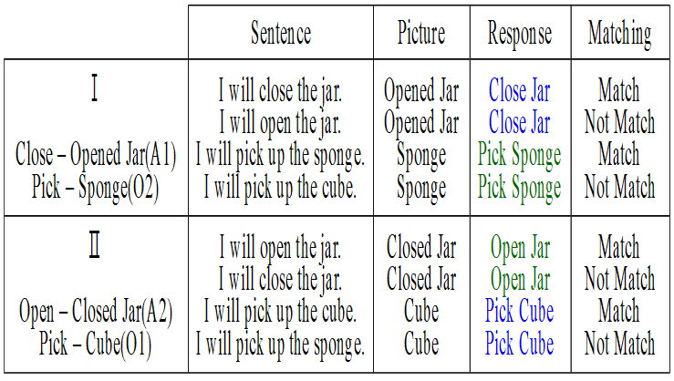
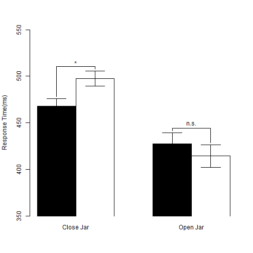

## Outline
1. Why study mental simulation
2. How to measure mental simulation
3. Experiment and findings
4. Reproducibility


[See source files](https://github.com/SCgeeker/ActObj)

--- .dark .segue

## Why study mental simulation?

--- &twocol
## Why?
**Colorless green ideas sleep furiously.**

*** =left


*** =right


*** =pnotes
Standard Cognitive Computation vs. Conceptualized Embodiment

--- &twocol
## How many perspectives?
 |Shapiro(2010) |Rowlands(2010)  
--- | ------------- | --------------  
 |<font color="red">Conceptulization</font>|Embodied mind  
 |Replacement |Enacted mind  
 |Constitution |Extended mind, Embeded mind  


--- .dark .segue

## How to measure mental simulation?

--- 
## Measurements
>- Sentence-picture verification task
  + Matching effect
>- Word color discrimination
  + Compatibility effect (Simon effect)

---
## Sentence-picture verification: Example
>- I want to eat the **egg** in the *dish*.

>- Match the **picture** and **bold word** in next slide.

---
## Sentence-picture verification: Example

   

>- <center>Hardly choose **YES**?</center>  

Is it match?  

1. YES
2. NO


---
## Matching Effects

<!-- html table generated in R 3.1.3 by xtable 1.7-4 package -->
<!-- Mon May 18 12:09:44 2015 -->
<table border=1>
<tr> <th>  </th> <th> Match </th> <th> Mismatch </th>  </tr>
  <tr> <td align="center"> RT </td> <td align="center"> 697.00 </td> <td align="center"> 761.00 </td> </tr>
  <tr> <td align="center"> Correct Rate </td> <td align="center"> 97.00 </td> <td align="center"> 93.00 </td> </tr>
   </table>
  
Zwaan, Stanfield, & Yaxley (2002)   
>- Embodied Simulation Hypothesis: "Perceptual symbols are activated after reading sentence"   
>- Supoort **Perceptual Symbol System**(Barsalou, 1999)

---
## Matching Effects
>- Positive matching effect (Match < Mismatch)
   + shape (Zwaan, Stanfield, and Yaxley, 2002)
   + orientation (Stanfield & Zwaan, 2001)
>- Negative matching effect (Match > Mismatch)
   + color (Connell, 2007)
>- Replication problem
   + Zwaan & Pecher(2012)
   + color > shape > orientation
>- Thinking
   + Sentence-picture verification is a potential tool to inspect language comprehension rather than to inspect embodied cognition
   + ["... I see embodiment as a means and not as an end."](http://rolfzwaan.blogspot.tw/2013/01/reproducing-pencils-and-eagles-but-not.html) (retrieved from Rolf Zwaan's blog, 2013/1/15)


--- &vcenter .large
</br>
</br>
<center><h3>Could we investigate the implicit processing of mental simulation?</h3></center>
</br>
>- <center>There is no standard paradigm to measure the implicit mental simulation.</center>

---
## Extrinsic Affective Simon Task (EAST; De Houwer, 2003)
>- Word meaning classification -> Establish meaning-response compatibility
   + Key 1 = *Happy*   Key 2 = *Disgust*
>- Word color discrimination -> Measure compatibity effect
   + Key 1 = <font color="blue">Color1</font>    Key 2 = <font color="green">Color2</font>
   + Word 1 = *Happy*  Word 2 = *Disgust*
>- Compatible Case
   + Key 1 ~ <font color="blue">*Happy*</font>   Key 2 ~ <font color="green">*Disgust*</font>
>- Incompatible Case
   + Key 1 ~ <font color="blue">*Disgust*</font>   Key 2 ~ <font color="green">*Happy*</font>

---
## Original EAST Results
<!-- html table generated in R 3.1.3 by xtable 1.7-4 package -->
<!-- Mon May 18 12:09:44 2015 -->
<table border=1>
<tr> <th>  </th> <th> Word meaning: Happy </th> <th> Word meaning: Disgust </th>  </tr>
  <tr> <td> Compatible Response </td> <td align="right"> 660.00 </td> <td align="right"> 636.00 </td> </tr>
  <tr> <td> Incompatible Response </td> <td align="right"> 707.00 </td> <td align="right"> 678.00 </td> </tr>
   </table>
De Houwer(2003), Experiment 1

---
## Modified EAST Design
>- Word meaning classification 
   + --> Sentence-picture Verification
   + Build **situation** in imagination
>- Word color discrimination 
   + Critical words associated _actions_ and _feelings_
   + Actions and feelings matched the **situation**
>- Two measurements
   + Matching effect: Sentence-picture Verification
   + Compatibility effect: Word color discrimination

---
## Hypothesis
- Embodied Simulation Hypothesis 
  - People comprehend the linguistic forms of objects as the way people **see** the objects in the real world (Bergen, 2012).
  - **see** -> **move**? **observe**?

>- I will **take** this iron box.
>- I will **touch** this iron box.

---
## Situational Properties 
>- **Actions**
   + Observe: have not to exhaust strength
   + Move: have to exhaust strength
>- **Objects**
   + Observed objects generate the feeling about *texture*
   + Moved objects generate the feeling about *weight*
>- **Feelings**
   + Texture
   + Weight

---
## Critical Measurements
>- Matching effect 
   + Which constituents in the situation could be explicit to our imagination?
>- Compatibility effect
   + Which constituents in the situation have the advantage established the implicit association of two unrelated imagination?

---
## Predictions
>- Sentence-picture verification task: human mind would simulate the **action** on the target **object** and the **feeling**.
  + Matching effect would happen to the pitcure that does not match the probe sentence.
>- Word color discrimination task: human mind would process the implicit association of the **action** and the **feeling**.
  + Compatibility effect would happen to the word represented **action** or **feeling** but the color instructed the incompatible response key.

--- .dark .segue

## Experiment and findings

---
## Procedure


---
## Sentence-Picture Verification: Stimuli Sentence


---
## Sentence-Picture Verification: Stimuli Picture


---
## Sentence-Picture Verification: Response keys


---
## Word Color Discrimination: Twist-Tight Pick-Loose


---
## Word Color Discrimination: Twist-Loose Pick-Tight


---
## Word Color Discrimination: Response keys


---
## Analysis protocal
>- Sentence-picture verification
   + Response key sets _X_ Matching
   + All trials in warm up blocks 1~5
>- Word-color discrimination
   + Three sets of target words: Blue critical, Green critical, Filler
   + Critical words: Word types _X_ Association types _X_ Compatibility
   + Filler words: Word types _X_ (Test) Blocks _X_ Compatibility


---
## Results
>- Matching Effects
   + Twist: *Close* had a positive effect; *Open* had a negative effect.
   + Pick: *Cube* and *Sponge* had positive effects.
>- Compatibility Effects
   + Blue Critical Words: **Twist-tight** had a positive effect,
   + Greeb Crutucak Wirds: All sets tend to be negative.
   + Filler Words: No effects.

```
## Error in matrix(matrix(RT, 2)[2, ] - matrix(RT, 2)[1, ], 4)[, 1:20]: subscript out of bounds
```

```
## Error in matrix(matrix(RT, 2)[2, ] - matrix(RT, 2)[1, ], 6)[, 1:20]: subscript out of bounds
```

--- &twocol
## Sentence-Picture Verification: Summary

*** =left
 

*** =right

 


---
## Sentence-Picture Verification: ANOVA
<!-- html table generated in R 3.1.3 by xtable 1.7-4 package -->
<!-- Mon May 18 12:09:45 2015 -->
<table border=1>
<tr> <th>  </th> <th> Df </th> <th> Sum Sq </th> <th> Mean Sq </th> <th> F value </th> <th> Pr(&gt;F) </th>  </tr>
  <tr> <td> Series    </td> <td align="right"> 1 </td> <td align="right"> 9231.10 </td> <td align="right"> 9231.10 </td> <td align="right"> 0.79 </td> <td align="right"> 0.3896 </td> </tr>
  <tr> <td> Residuals </td> <td align="right"> 14 </td> <td align="right"> 163899.55 </td> <td align="right"> 11707.11 </td> <td align="right">  </td> <td align="right">  </td> </tr>
  <tr> <td> Matching        </td> <td align="right"> 1 </td> <td align="right"> 9843.50 </td> <td align="right"> 9843.50 </td> <td align="right"> 10.99 </td> <td align="right"> 0.0051 </td> </tr>
  <tr> <td> Series:Matching </td> <td align="right"> 1 </td> <td align="right"> 1903.73 </td> <td align="right"> 1903.73 </td> <td align="right"> 2.13 </td> <td align="right"> 0.1669 </td> </tr>
  <tr> <td> Residuals       </td> <td align="right"> 14 </td> <td align="right"> 12537.52 </td> <td align="right"> 895.54 </td> <td align="right">  </td> <td align="right">  </td> </tr>
  <tr> <td> Situation          </td> <td align="right"> 2 </td> <td align="right"> 9333.16 </td> <td align="right"> 4666.58 </td> <td align="right"> 3.29 </td> <td align="right"> 0.0520 </td> </tr>
  <tr> <td> Situation:Matching </td> <td align="right"> 2 </td> <td align="right"> 3554.30 </td> <td align="right"> 1777.15 </td> <td align="right"> 1.25 </td> <td align="right"> 0.3011 </td> </tr>
  <tr> <td> Residuals          </td> <td align="right"> 28 </td> <td align="right"> 39700.11 </td> <td align="right"> 1417.86 </td> <td align="right">  </td> <td align="right">  </td> </tr>
   </table>

--- &twocol

## Word Color Discrimination: Critical Blue Words

***=left


